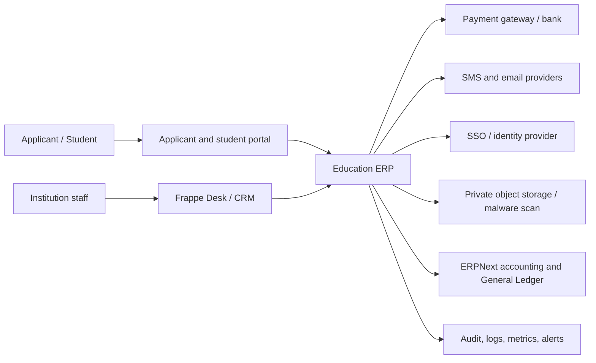
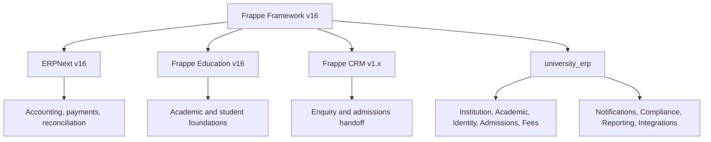
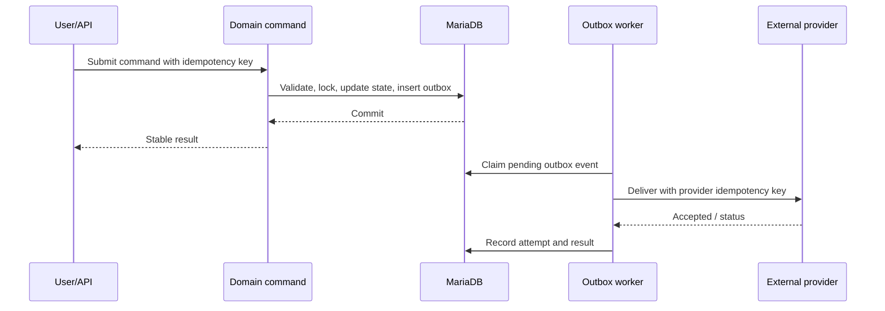

# System Architecture

## Purpose

This document defines the logical architecture for Phase 1 and the boundaries that allow the product to scale without prematurely splitting transactional workflows across services.

## Context

## Architectural style

Use a modular monolith inside `university_erp`. Frappe owns metadata, persistence, permissions, workflows, queues, scheduler, APIs, files, and administration. Domain modules own business terminology and rules.

| Module | Owns | Must not own |
|---|---|---|
| Institution | Hierarchy, reporting scope, structure versions | Student or financial transactions |
| Academic | Sessions, programs, curriculum, classes, sections, timetable, intake | Admissions decisions or ledger postings |
| Student Identity | Permanent identity, guardians, category history, consent, corrections | Applicant pipeline or accounting |
| Admissions | Applications, eligibility, merit, seat allocation, offers, conversion | Permanent accounting ledger |
| Fees | Fee policy, applicability, demands, schedules, concessions | A parallel General Ledger |
| Notifications | Templates, outbox, delivery attempts, consent enforcement | Source business state |
| Compliance | Audit events, privacy controls, retention workflows | Domain transaction ownership |
| Reporting | Permission-safe projections and exports | Authoritative mutable records |
| Integrations | Provider adapters, signatures, reconciliation | Provider-specific logic in domain controllers |

## Application topology

## Processing models

### Synchronous commands

Use synchronous transactions for validations and state changes that must be atomic: seat acceptance, applicant conversion, fee demand creation, payment posting, status transitions, and approval decisions.

### Background jobs

Use queues for bulk imports, merit generation, fee generation, document scanning, report exports, notification delivery, settlement ingestion, and scheduled reminders. Jobs must be idempotent, bounded, observable, and resumable.

### Transactional outbox

The transaction that changes domain state also writes an outbox event. A worker publishes or handles that event after commit. Do not call providers before the source transaction commits.

## Release-blocking invariants

- Seat acceptance cannot exceed the effective seat matrix, including concurrent requests.
- A provider transaction can produce at most one posted accounting result.
- Applicant conversion can produce at most one Student and enrollment identity.
- Published merit runs and effective academic versions are immutable.
- Fee operational totals reconcile to ERPNext accounting documents and General Ledger.
- Locks and approval requirements are enforced server-side.
- Jobs and webhooks tolerate duplicate, delayed, and out-of-order delivery.
- Sensitive files remain private and quarantined until validation and scanning pass.

## Scalability model

1. Scale stateless web and worker replicas horizontally.
2. Separate queues by latency and workload profile.
3. Optimize measured queries and add reviewed indexes.
4. Move files and generated exports to object storage.
5. Use read replicas only for explicitly safe reporting paths.
6. Automate site provisioning and enforce per-site quotas.
7. Extract a service only after an ADR proves independent scale, security, runtime, or failure-boundary needs.

An extracted service must own its data, expose versioned idempotent contracts, publish observable events, and include reconciliation for partial failures.

## Availability and performance objectives

| Objective | Initial target |
|---|---:|
| Monthly availability | 99.9% excluding approved maintenance |
| P95 normal read API | Below 500 ms |
| P95 normal write API | Below 1 second |
| Application submission | Below 3 seconds excluding upload/payment provider |
| Payment webhook acknowledgement | Below 5 seconds |
| Notification queued | Below 60 seconds |
| RPO | 15 minutes |
| RTO | 2 hours |

Targets are release criteria only after load, restore, and failover tests demonstrate them using the pilot workload.

## Architecture review triggers

Create or update an ADR when changing tenancy, accounting flow, domain ownership, an authoritative data store, an external contract, security boundary, queue topology, deployment model, or production SLO.

