# System Architecture

## Purpose

This document defines the logical architecture for Phase 1 and the boundaries that allow the product to scale without prematurely splitting transactional workflows across services.

## Context

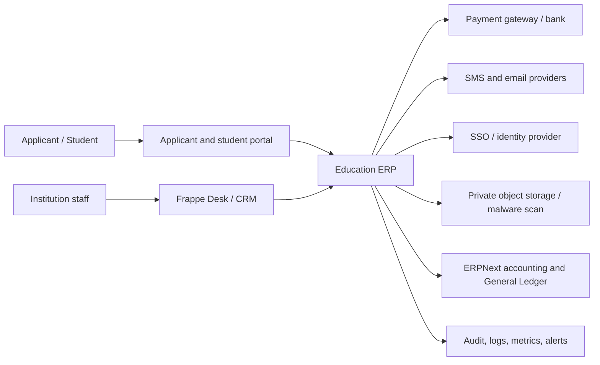

## Architectural style

Use a modular monolith inside `university_erp`. Frappe owns metadata, persistence, permissions, workflows, queues, scheduler, APIs, files, and administration. Domain modules own business terminology and rules.

| Module | Owns | Must not own |
|---|---|---|
| Institution | Hierarchy, reporting scope, structure versions | Student or financial transactions |
| Academic | Sessions, programs, curriculum, classes, sections, timetable, intake | Admissions decisions or ledger postings |
| Student Identity | Permanent identity, guardians, category history, consent, corrections | Applicant pipeline or accounting |
| Admissions | Applications, eligibility, merit, seat allocation, offers, conversion | Permanent accounting ledger |
| Fees | Fee policy, applicability, demands, schedules, concessions | A parallel General Ledger |
| Notifications | Templates, outbox, delivery attempts, consent enforcement | Source business state |
| Compliance | Audit events, privacy controls, retention workflows | Domain transaction ownership |
| Reporting | Permission-safe projections and exports | Authoritative mutable records |
| Integrations | Provider adapters, signatures, reconciliation | Provider-specific logic in domain controllers |

## Application topology

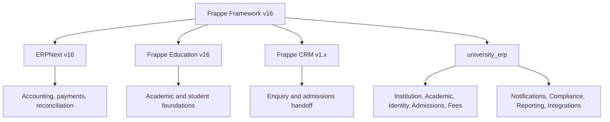

## Processing models

### Synchronous commands

Use synchronous transactions for validations and state changes that must be atomic: seat acceptance, applicant conversion, fee demand creation, payment posting, status transitions, and approval decisions.

### Background jobs

Use queues for bulk imports, merit generation, fee generation, document scanning, report exports, notification delivery, settlement ingestion, and scheduled reminders. Jobs must be idempotent, bounded, observable, and resumable.

### Transactional outbox

The transaction that changes domain state also writes an outbox event. A worker publishes or handles that event after commit. Do not call providers before the source transaction commits.

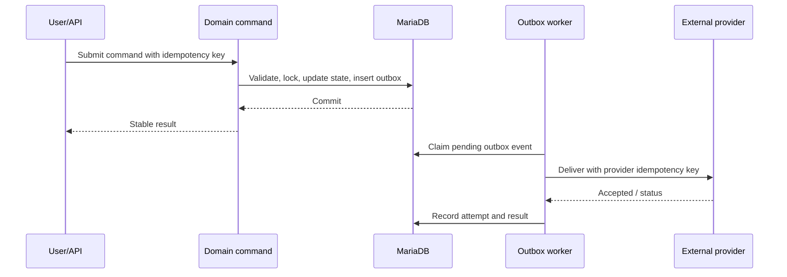

## Release-blocking invariants

- Seat acceptance cannot exceed the effective seat matrix, including concurrent requests.
- A provider transaction can produce at most one posted accounting result.
- Applicant conversion can produce at most one Student and enrollment identity.
- Published merit runs and effective academic versions are immutable.
- Fee operational totals reconcile to ERPNext accounting documents and General Ledger.
- Locks and approval requirements are enforced server-side.
- Jobs and webhooks tolerate duplicate, delayed, and out-of-order delivery.
- Sensitive files remain private and quarantined until validation and scanning pass.

## Scalability model

1. Scale stateless web and worker replicas horizontally.
2. Separate queues by latency and workload profile.
3. Optimize measured queries and add reviewed indexes.
4. Move files and generated exports to object storage.
5. Use read replicas only for explicitly safe reporting paths.
6. Automate site provisioning and enforce per-site quotas.
7. Extract a service only after an ADR proves independent scale, security, runtime, or failure-boundary needs.

An extracted service must own its data, expose versioned idempotent contracts, publish observable events, and include reconciliation for partial failures.

## Availability and performance objectives

| Objective | Initial target |
|---|---:|
| Monthly availability | 99.9% excluding approved maintenance |
| P95 normal read API | Below 500 ms |
| P95 normal write API | Below 1 second |
| Application submission | Below 3 seconds excluding upload/payment provider |
| Payment webhook acknowledgement | Below 5 seconds |
| Notification queued | Below 60 seconds |
| RPO | 15 minutes |
| RTO | 2 hours |

Targets are release criteria only after load, restore, and failover tests demonstrate them using the pilot workload.

## Architecture review triggers

Create or update an ADR when changing tenancy, accounting flow, domain ownership, an authoritative data store, an external contract, security boundary, queue topology, deployment model, or production SLO.

---

## Product deployment baseline

| Area | Selected technology or service |
|---|---|
| Hosting | Hostinger self-managed VPS |
| Edge, DNS, TLS, WAF | Cloudflare |
| Object storage | Cloudflare R2 using private S3-compatible access |
| Payments | Razorpay |
| SMS and OTP | MSG91, subject to DLT/sender ownership approval |
| Email | Hostinger Business Email SMTP initially |
| Staff UI | Frappe Desk and Frappe CRM UI where CRM is used |
| Public UI | Vue 3, TypeScript, Frappe UI, Vite, responsive PWA |
| Backend | Python 3.14 and Frappe Framework v16 |
| Business apps | ERPNext v16, Frappe Education v16, Frappe CRM v1.x |
| Custom app | `university_erp` |
| Database | MariaDB 11.8, one site database per institution |
| Cache and queues | Redis/Valkey and Frappe background jobs |
| Files and scanning | Cloudflare R2 plus ClamAV quarantine pipeline |
| Containers | Pinned custom image based on official `frappe_docker` |
| Metrics and dashboards | Prometheus and Grafana |
| Logs | Loki with controlled access and retention |
| Availability monitoring | Uptime Kuma plus infrastructure alerts |
| Languages | English and Hindi initially |

All versions and provider credentials are environment-specific and pinned or managed outside source control. Production credentials may never be reused in development or UAT.

## Users and product applications

The product is one platform with several task-focused applications. It must not expose one complex administrative interface to every user.

| Application | Primary users | Technology | Core capabilities |
|---|---|---|---|
| Platform Operations Console | Platform operations and support | Restricted Frappe Desk workspace | Site inventory, release/schema status, quotas, backup state, integration health |
| Institution Administration | School/university administrators | Frappe Desk | Institution, academic calendar, programs/grades, classes, sections, roles, configuration |
| Admissions Workspace | Admission managers and officers | Frappe Desk | Applications, scrutiny, eligibility, merit, seats, offers, confirmation, cancellation |
| Counsellor CRM | Counsellors and enquiry staff | Frappe CRM | Leads, sources, follow-ups, calls, tasks, application handoff |
| Student Administration | Registrars and authorized staff | Frappe Desk | Student identity, guardians, documents, corrections, lifecycle, promotion |
| Finance Workspace | Finance managers and operators | ERPNext/Frappe Desk | Fee policy, demands, invoices, payments, refunds, settlements, GL reconciliation |
| Academic Operations | Academic administrators and faculty | Frappe Desk | Curriculum, subjects, timetable, faculty assignments, class/section operations |
| Applicant/Guardian Portal | Applicants and guardians | Vue 3 bilingual PWA | Register, apply, upload, pay, track, accept offer, download receipt |
| Student/Guardian Portal | Students and guardians | Vue 3 bilingual PWA | Profile, fee dues, payments, receipts, documents, notices, preferences |
| Faculty Portal/Workspace | Teachers | Responsive Frappe workspace initially | Assigned classes/subjects and approved student operations |
| Auditor Workspace | Internal/external auditors | Read-only Frappe workspace | Audit events, approvals, finance reconciliation, permission-safe exports |
| Support Workspace | Authorized support staff | Restricted Frappe workspace | Correlated support cases without uncontrolled access to PII |

The Phase-1 pilot validates institution setup, admissions, student identity, fees, payments, documents and notifications. Attendance, examinations, report cards, transport, hostel, library, LMS, HR/payroll and accreditation analytics require approved later-phase requirements.

## Full product component architecture

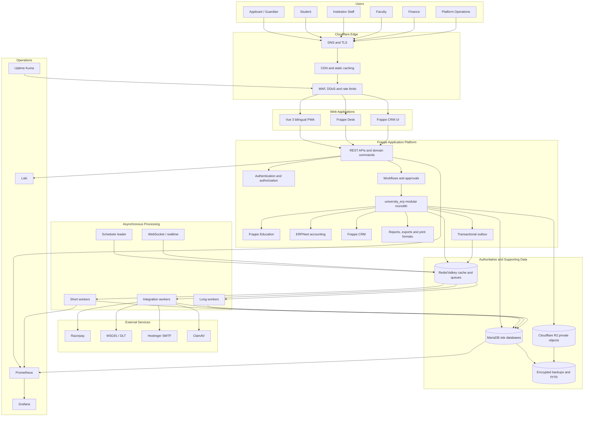

## Application responsibilities

### Frappe Framework

Frappe owns authentication, sessions, role and field permissions, DocTypes, ORM, workflows, generated Desk interfaces, APIs, scheduler, queues, files, audit foundations, reports, print formats, translations and multi-site runtime.

### ERPNext

ERPNext owns Company, chart of accounts, accounting dimensions, Sales Invoice or approved receivable documents, Payment Request, Payment Entry, refunds/reversals, bank transactions, reconciliation and General Ledger. Custom code may orchestrate these records but may not create a second financial ledger.

### Frappe Education

Education provides reusable Student, Student Applicant, Program, Course, Program Enrollment and related education foundations where semantics match. `university_erp` extends or governs them rather than duplicating standard concepts without fit-gap evidence.

### Frappe CRM

CRM owns pre-application enquiries, source/campaign, counsellor assignment, follow-up, calls, tasks and lead/deal pipeline. A controlled idempotent handoff creates or links an Admission Application. CRM is not the permanent Student master.

### `university_erp`

The custom app owns all institution-specific academic governance, school/university variations, NEP/CBCS rules, identity controls, eligibility, merit, seats, education fee policy, notification outbox, privacy controls, provider adapters and permission-safe reporting.

## Custom domain modules

| Module | Responsibilities | Key records/services |
|---|---|---|
| Institution | Hierarchy, structure versions, reporting scope, institutional configuration | Institution Node, Structure Version, Change Request |
| Academic | Sessions, calendar, program/grade, curriculum, class, section, subject, timetable, faculty, intake | Program Version, Offering, Class Offering, Section, Timetable, Intake |
| Student Identity | Applicant/student identity, guardians, identifiers, status, dedupe, corrections, consent | Student extensions, Guardian, Status History, Correction, Merge Request |
| Admissions | Cycles, dynamic forms, application workflow, scrutiny, eligibility | Admission Cycle, Form Version, Application, Eligibility Evaluation |
| Merit and Seats | Merit configuration/run, tie breakers, capacity, waitlist, offers | Merit Run, Merit Entry, Seat Matrix, Allocation Run, Seat Offer |
| Fees | Fee groups, codes, policy versions, applicability, schedules, demands, concessions and fines | Fee Policy, Fee Plan, Fee Demand, Installment, Concession, Fine Assessment |
| Payments | Razorpay orders/webhooks, offline evidence, allocation, refunds and settlement coordination | Payment Intent, Provider Event, Allocation, Refund Request, Settlement Import |
| Documents | Requirements, private upload, quarantine, scan, verification, replacement and expiry | Requirement Matrix, Applicant/Student Document, Scan Result, Verification |
| Notifications | Templates, consent, outbox, delivery attempts, throttles and provider status | Template Version, Domain Event, Outbox, Delivery Attempt |
| Compliance | Domain audit, data access logs, retention, legal hold and privacy operations | Audit Event, Access Log, Retention Job, Export Approval |
| Reporting | Operational dashboards, scheduled/private exports and reconciliation views | Permission-safe queries, reports, export jobs |
| Integrations | Stable ports and provider-specific adapters | Razorpay, MSG91, SMTP, R2, ClamAV adapters |

## Frontend architecture

### Staff and operations interfaces

Use Frappe Desk for internal CRUD, workflow, approvals, lists, reports, imports and administration. Build custom Desk pages only for workflows that cannot be made usable through standard forms, such as merit review, seat allocation, bulk promotion, fee reconciliation and operational dashboards.

### Applicant, guardian and student PWA

Use Vue 3, TypeScript, Frappe UI and Vite. The portal consumes only versioned public/portal APIs and must not directly reproduce server-side authorization or calculations.

```text
Vue route/page
    -> presentation component
        -> typed portal API client
            -> Frappe API/domain command
                -> server-side permission and policy
```

Required portal capabilities:

- mobile OTP or approved passwordless login for guardians/applicants;
- English/Hindi switch visible on every primary screen;
- guardian account with multiple children;
- task-based wizard with autosave and resume;
- simple labels, large touch targets and icons accompanied by text;
- camera/file upload with compression, progress and retry;
- clear pending/success/failure payment states;
- application, offer, admission, fee and receipt status;
- low-bandwidth operation, skeleton/loading states and safe retries;
- WCAG-oriented keyboard, contrast, focus and screen-reader behavior;
- server-provided validation messages translated into plain English/Hindi.

The portal is a PWA initially. Native mobile applications are deferred until offline operation, native push, device security or app-store distribution is proven necessary.

## Authentication and authorization architecture

| User type | Authentication | Additional controls |
|---|---|---|
| Applicant/guardian | Mobile OTP initially; recovery workflow | Rate limiting, consent, device/session monitoring |
| Student | Institution-enabled portal account | Status-based enable/disable, guardian linkage where appropriate |
| Institution staff | Password or SSO | MFA for privileged roles, session policy, campus scope |
| Finance/security/admin | Password/SSO plus MFA | Maker-checker, restricted exports, sensitive audit |
| Service integration | Scoped API/OAuth credential | Per environment/site/provider, rotation, IP/egress controls |
| Platform operations | SSO/MFA and restricted admin path | Break-glass control, access logging, least privilege |

Authorization is evaluated server-side using site, role, institution/campus node, record ownership, field permission level, workflow state and explicit approval. UI visibility never substitutes for authorization.

## Multi-institution tenancy and site provisioning

Each independently governed institution receives:

- one Frappe site and MariaDB database;
- separate site encryption and backup keys;
- private R2 bucket or approved isolated namespace and credentials;
- Razorpay configuration and settlement identity;
- MSG91/DLT sender and template mapping;
- Hostinger SMTP/domain identity;
- institution roles, users, settings, quotas and audit history;
- independently testable backup and restore.

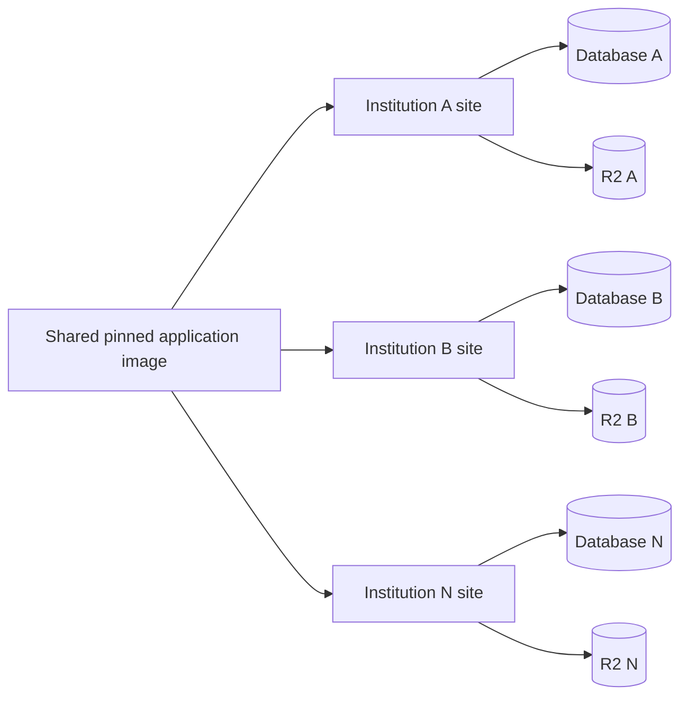

Site provisioning is automated and records institution, domain, pod, image digest, schema version, database, storage, quotas, integrations, backup state and operational owner in a fleet inventory. There is no universal `tenant_id` added to every business table.

## Core business workflows

### Enquiry to student

```mermaid
flowchart LR
    Enquiry["CRM Enquiry"] --> Application["Admission Application"]
    Application --> Eligibility["Eligibility Evaluation"]
    Eligibility --> AppFee["Application Fee"]
    AppFee --> Scrutiny["Document Scrutiny"]
    Scrutiny --> Merit["Merit / Selection"]
    Merit --> Offer["Seat Offer"]
    Offer --> Accept["Accept / Reject / Expire"]
    Accept --> Confirm["Admission Confirmation"]
    Confirm --> Student["Student and Enrollment"]
    Student --> Fee["Student Fee Demand"]
```

Application, payment, merit, offer and conversion commands are idempotent. Published merit is immutable. Final-seat acceptance uses transactionally protected capacity. Repeated conversion returns the existing Student rather than creating another.

### Fee and payment

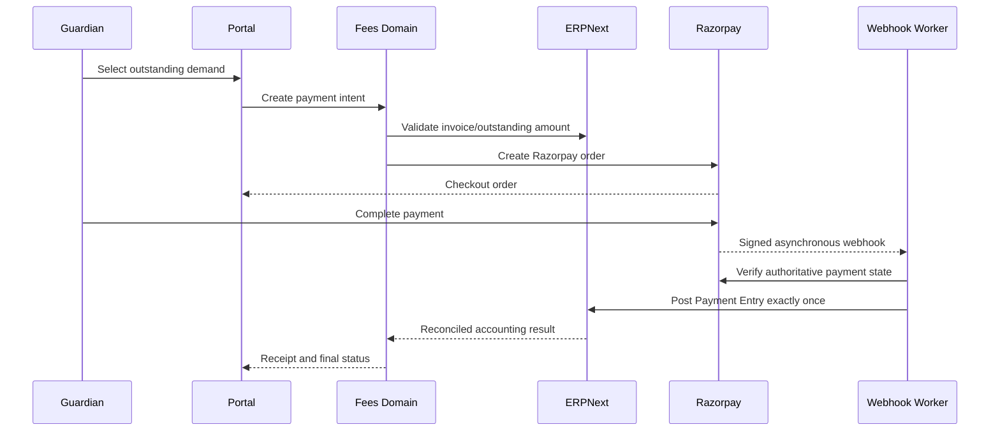

The browser callback never proves payment. Provider event identity, payment identity, amount and currency are verified. Payment state, accounting-posting state and settlement state remain independently observable and reconcilable.

### Notification delivery

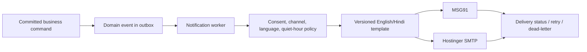

Each institution has quotas and provider configuration. DLT Principal Entity, header and content-template IDs are included according to the approved sender model.

### Document upload and verification

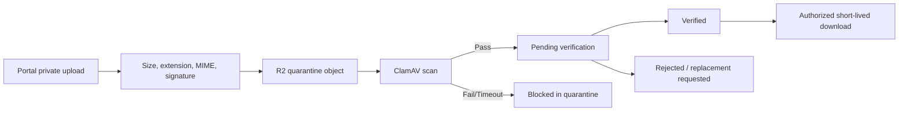

No public bucket or permanent public URL is used for student/applicant documents. File access, verification, rejection, replacement and export are audited.

## API and event architecture

- Standard Frappe resource APIs are used only for straightforward permission-safe CRUD.
- Domain commands are explicit versioned whitelisted methods under `university_erp.api.v1`.
- State-changing endpoints use POST and server-side authorization.
- List endpoints have bounded pagination, deterministic order and approved filters.
- Idempotency keys are mandatory for payment, seat, conversion and retried commands.
- Errors expose stable codes and safe English/Hindi messages, not stack traces.
- Correlation IDs connect web requests, commands, jobs, provider calls and audit events.
- Domain events are past-tense versioned facts handled through the transactional outbox.
- Webhooks validate raw-body signature, timestamp/replay policy, provider identity and unique event ID before asynchronous processing.

## Data architecture

| Store | Data | Authority and rules |
|---|---|---|
| MariaDB site database | Business records, configuration, workflow, accounting links, audit | Authoritative transactional store per institution |
| ERPNext General Ledger | Posted financial results | Sole financial accounting authority |
| Redis/Valkey cache | Derived/temporary cache and session coordination | Loss may degrade service but cannot lose authoritative data |
| Redis/Valkey queues | Pending background work and realtime coordination | Jobs are retry-safe and idempotent |
| Cloudflare R2 | Private files, receipts, exports, backup objects | Database stores ownership/status/checksum metadata |
| Metrics/logs | Operational telemetry | No secrets or unnecessary PII; bounded retention |
| Backups/PITR | Recovery copies | Encrypted, off-host, immutable/versioned and restore-tested |

Stable identity, effective version and operational offering are separate. Published academic, merit, intake, reservation and fee versions are never edited in place. Referenced master records are deactivated rather than hard-deleted. Financial corrections use cancellation/reversal and replacement.

## Queue topology

| Queue | Workloads | Operational objective |
|---|---|---|
| `short` | Simple notifications, delivery callbacks, small webhooks | Low latency; normally below 60 seconds oldest age |
| `long` | Imports, merit generation, fee batches, large exports | Bounded concurrency and resumable checkpoints |
| `payments` | Razorpay verification, posting, refunds, settlement | Strict idempotency and high-priority monitoring |
| `notifications` | SMS/email delivery and retries | Per-site/provider throttle and dead-letter state |
| `documents` | Malware scan, conversion and metadata extraction | Quarantine preserved during outage |
| `reports` | Large permission-safe exports | Resource quotas; never starve payment/admission work |

Custom queues are introduced only when the deployed Frappe version and operational tooling support them reliably. Otherwise, equivalent worker pools and job classification enforce the same isolation.

## Hostinger production deployment architecture

### Pilot topology

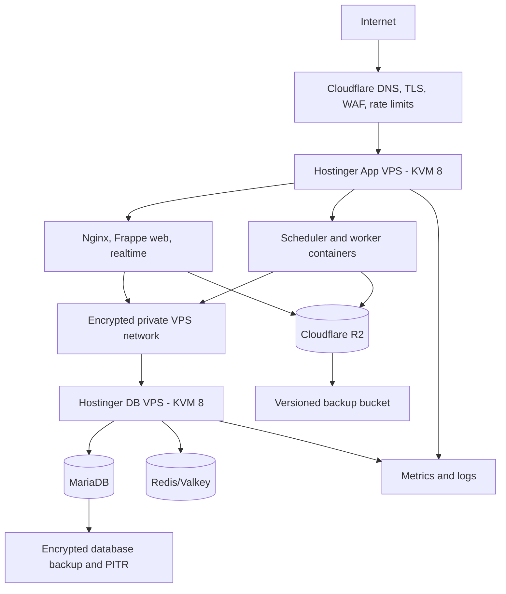

The pilot separates application and database workloads. An all-in-one VPS is permitted only for disposable development, never the production pilot. Hostinger snapshots supplement but do not replace application-aware database backups, R2 versioning and restore tests.

### Scale-out pod topology

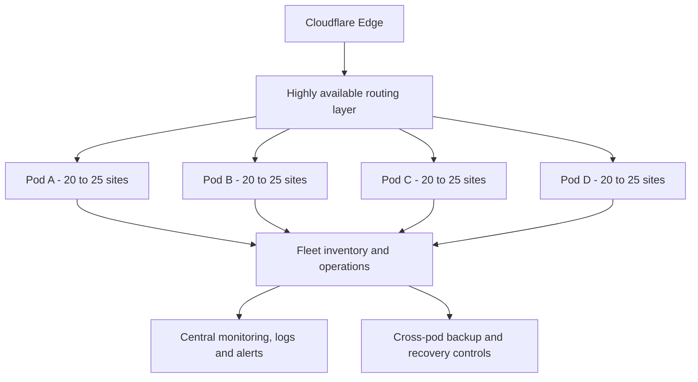

Each mature pod contains two application nodes, database primary, optional tested replica/failover candidate, Redis/Valkey, worker pools and independently recoverable site backups. Pod size is adjusted from measured CPU, database, storage, queue, support and migration behavior rather than site count alone.

## Network and trust boundaries

- Only Cloudflare/proxy-approved web endpoints are public.
- Database and Redis/Valkey are never publicly exposed.
- VPS-to-VPS traffic uses an encrypted private network and strict firewall allowlists.
- SSH uses keys, restricted source access, non-root daily operation and audited privilege escalation.
- Provider egress is restricted where operationally practical.
- R2 tokens are scoped to the minimum bucket and permission.
- Production secrets are injected from approved protected configuration and rotated.
- Administrative/platform access requires MFA and is logged.
- Development and UAT cannot reach production databases, buckets or provider credentials.

## Security architecture

Security controls apply at edge, identity, application, data, file, integration, infrastructure and operations layers:

- Cloudflare DDoS/WAF/rate controls and TLS;
- OTP abuse prevention and staff MFA;
- site/role/campus/record/field/workflow permissions;
- maker-checker approvals for high-risk admission, identity and finance actions;
- input validation, output encoding, CSRF/session protection and controlled CORS;
- encryption in transit and at rest;
- masked sensitive identifiers and private exports;
- webhook signature/replay validation and idempotency;
- private file quarantine and malware scanning;
- managed secrets and credential rotation;
- append-only domain audit events and protected diagnostic logs;
- dependency, image and application scanning in CI;
- backup isolation and tested incident response.

Full Aadhaar is not a default identifier. If later approved, lawful authority, collection purpose, masking, encryption, access logging and retention must be documented before implementation.

## Observability architecture

Every request, command, event, job and provider action carries a correlation ID. Telemetry includes release/image, service, environment, safe site identifier, operation, duration, result and safe error code.

Required dashboards:

- availability, latency, errors and error-budget burn;
- admission/application and seat contention;
- fee, payment posting, refund, settlement and GL reconciliation;
- queues, workers, scheduler and dead-letter state;
- MariaDB connections, slow queries, locks, storage and backup age;
- R2 upload/scan/quarantine/access failures;
- MSG91 and SMTP delivery, throttling and template errors;
- site fleet image/schema drift, quotas and backup state;
- authentication anomalies, permission denials and sensitive exports.

Page on invariant breach, payment/accounting mismatch, database unavailability, unrecovering queue age, scheduler loss, backup failure, security incident and deployment/schema drift. Non-urgent trends create tickets rather than pages.

## Environments and CI/CD

```text
Local synthetic development
    -> CI ephemeral sites
        -> Shared development
            -> UAT with synthetic/masked data
                -> Production-like staging
                    -> Production pilot
                        -> Controlled institution waves
```

The pipeline performs format/lint/static checks, secrets scan, unit/integration/permission tests, fresh install, supported migration, API contracts, image build, SBOM, vulnerability scan, signature, UAT deployment, staging rehearsal and approved production promotion.

The same image digest is promoted. Production containers never run interactive `git pull`, `bench get-app` or source edits. Schema changes use expand-and-contract. Application rollback is allowed only when schema and queued-event compatibility are proven.

## Capacity assumptions and scale triggers

Planning range for 100 small institutions, pending pilot measurement:

| Metric | Planning range |
|---|---:|
| Active students | 60,000 to 80,000 |
| Guardians | 90,000 to 120,000 |
| Staff users | 4,000 to 6,000 |
| Annual applications | 7,000 to 12,000 |
| Peak concurrent users | 500 to 1,500 platform-wide |
| Initial active private files | 500 GB to 1 TB |
| Five-year object storage | 2 TB to 4 TB before policy refinement |

Scale or rebalance a pod before sustained CPU/database saturation, disk above 70 percent, queue SLO breach, unacceptable P95/P99 latency, migration window overrun, backup/RTO risk or noisy-neighbor behavior. Keep at least 40 percent tested headroom for admission/payment peaks before onboarding the next wave.

## Availability, backup and disaster recovery

- Monthly availability target: 99.9 percent excluding approved maintenance.
- RPO: 15 minutes.
- RTO: 2 hours.
- Daily full site/database backup plus MariaDB binary-log/PITR chain.
- R2 versioning and isolated backup bucket/account credentials.
- Site configuration, encryption key, image digest and app SHA manifest protected with each recovery set.
- Monthly restore verification across rotating sites.
- Disaster-recovery exercise before pilot and at least twice yearly.
- No rollout wave advances with failed backup, stale restore evidence or unresolved data-integrity risk.

Recovery restores the matching database, files, site keys and immutable image, then validates permissions, private files, admission state, student identity, fees, accounting reconciliation, scheduler and queue controls before traffic resumes.

## Failure isolation and reconciliation

| Failure | Required behavior |
|---|---|
| Razorpay unavailable | Preserve payment intent as pending; do not mark paid; verify later |
| Duplicate/out-of-order webhook | Deduplicate and reconcile authoritative provider state |
| MSG91/SMTP unavailable | Business transaction succeeds; delivery retries without duplicates |
| R2 unavailable | Reject/defer upload safely; never create a verified missing document |
| ClamAV unavailable | Keep file quarantined and retry scan |
| Worker crash | Transaction rolls back or job resumes idempotently |
| Scheduler missed interval | Detect, calculate exact gap and replay idempotent jobs in bounded batches |
| Database failover/restore | Reconcile in-flight seat, payment, conversion and fee operations |
| Pod outage | Other pods remain available; affected sites follow pod recovery runbook |
| Bad release/migration | Stop site batches; forward-fix, compatible app rollback or approved restore |

## Production rollout architecture

| Wave | Institution target | Architecture requirement |
|---|---:|---|
| Pilot | 1 | Separate app/database VPS, R2, integrations, monitoring and restore proof |
| Wave 1 | 5 | Automated site onboarding, quotas, integration isolation and support process |
| Wave 2 | 20 | First production pod, tested upgrade batches and fleet inventory |
| Wave 3 | 50 | Multiple pods, centralized observability and pod recovery tests |
| Wave 4 | 100 | Four or more measured pods, DR, security and operations review |

Wave progression is evidence-driven. Site count alone does not prove capacity or readiness.

## Production readiness gates

The product is deployable only when:

- pinned app/image matrix and migrations pass;
- all Phase-1 requirements have traceable acceptance evidence;
- English/Hindi and low-literacy usability testing passes;
- permission matrix and private-file negative tests pass;
- final-seat concurrency cannot oversubscribe intake;
- duplicate payments cannot duplicate accounting;
- repeated conversion cannot duplicate Student/enrollment identity;
- fee, payment, refund and settlement totals reconcile to ERPNext GL;
- performance and queue tests meet SLOs with headroom;
- no unaccepted critical/high security findings remain;
- production-sized migration and reconciliation pass;
- backup restore and DR meet RPO/RTO;
- dashboards, alerts, runbooks, support and hypercare are active;
- product, institution, finance, security, engineering and operations owners approve.

## Open architecture decisions

The following must be resolved before their dependent production work:

1. Per-institution Razorpay merchant accounts versus approved platform settlement model.
2. Platform versus institution ownership of DLT Principal Entity, headers and templates.
3. Exact Hostinger regions and encrypted private-network design.
4. Database replica/failover method available within Hostinger constraints.
5. SMTP account/domain model and transition threshold to a dedicated transactional provider.
6. Pilot institution volumes, migration sources and opening financial balances.
7. Required attendance/examination scope for a complete high-school offering.
8. Retention, consent, document and Aadhaar policy.
9. Cross-institution analytics and its privacy/legal model.
10. Final support hours, incident severity and contractual SLA.

Record accepted decisions as ADRs and update this document in the same change.
