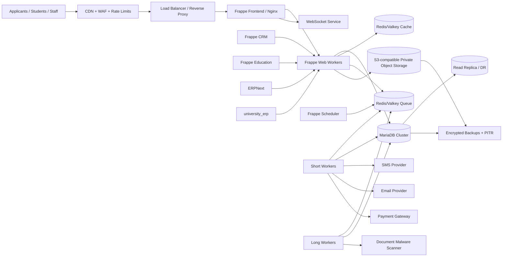
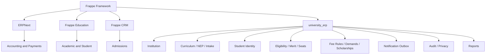
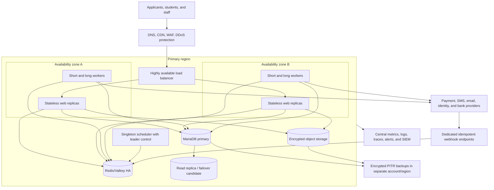

# AGENTS.md — Production Education ERP on Frappe

> **Status:** Build baseline  
> **Document version:** 1.3  
> **Prepared:** 2026-08-01  
> **Target platform:** Frappe Framework v16 + ERPNext v16 + Frappe Education v16 + Frappe CRM v1.x + custom app  
> **Primary market assumption:** Indian education institutions; the first pilot is a small-township high school  
> **Primary deployment model:** One Frappe site per independent university/institution, shared immutable application image  
> **Purpose:** This file is the source of truth for engineers, reviewers, DevOps operators, QA engineers, product owners, and AI coding agents working on the project.

---

## 1. Product mission

Build a stable, secure, upgradeable, NEP-aligned Education ERP that lets an institution:

- configure a university, campus, college, department, academic-session, program, specialization, class, section, subject, credit, intake, reservation, and major/minor structure;
- receive admission enquiries and manage counsellor follow-ups;
- accept online and offline applications;
- validate eligibility and documents;
- generate merit lists and allocate seats;
- convert an accepted applicant into a permanent student;
- create student and enrolment identities;
- configure, assign, collect, reconcile, refund, and report fees from Day 1;
- send event-driven SMS and email notifications;
- preserve auditable history and enforce role, institution, campus, document, field, and workflow permissions;
- support real pilot institutions without modifying upstream Frappe, ERPNext, Education, or CRM source code.

The supplied BRD contains 200 user stories across academic masters, student identity, admissions, and notifications. It also defines fee management at requirement level, but detailed numbered fee user stories must be added before fee development is considered complete.

### 1.1 Requirements authority and conflict policy

Use this precedence order when requirements disagree:

1. approved BRD change request or signed acceptance criteria;
2. the Phase-1 BRD and its 200 numbered user stories;
3. approved architecture decision records in `docs/adr/`;
4. this `AGENTS.md`;
5. implementation notes, tickets, comments, and assumptions.

Do not silently resolve a conflict by choosing the easiest implementation. Record the conflict, affected story IDs, decision owner, decision date, and chosen behavior. Architecture may constrain how a requirement is implemented, but it may not remove an in-scope business capability without an approved scope change.

Every feature branch or pull request must reference one or more requirement IDs. Use `BRD-US-001` through `BRD-US-200` for numbered stories and `BRD-FEE-###` for the detailed fee stories that must be created during Sprint 0.

### 1.2 Phase-1 scope contract

Phase 1 includes:

- academic and institutional masters, including timetable, clash detection, faculty workload/assignment, promotion, intake, CBCS, and NEP entry-exit rules;
- student master, identity, documents, privacy, corrections, consent, login controls, and bulk operations;
- minimum viable admissions from application through eligibility, merit, seat acceptance, confirmation, and student creation;
- Day-1 fee configuration, assignment, collection, installment, fine, discount, scholarship, receipt, reconciliation, search, and dashboards;
- shared SMS/email notification templates, triggers, retries, throttling, status, and audit logs;
- role, field, module, institution, campus, workflow, and record-level access controls with complete audit history.

Phase 2 items are extension points only. Do not implement full LMS, examination/evaluation, OBE/attainment analytics, hostel, transport, library, HR/payroll, or accreditation analytics unless an approved change request moves them into scope.

### 1.3 BRD traceability index

Maintain detailed acceptance criteria and automated/manual test evidence in `docs/requirements/traceability.md`. This index is the minimum coverage map:

| BRD IDs | Capability | Owning domain | Required evidence |
|---|---|---|---|
| `BRD-US-001..010` | Institution hierarchy and governance | Institution | Tree, history, lock, clone, and permission tests |
| `BRD-US-011..020` | Academic session and calendar | Academic | Lifecycle, copy, publish, and lock tests |
| `BRD-US-021..040` | Programs, courses, CBCS, and credits | Academic | Versioning, classification, and credit validation tests |
| `BRD-US-041..058` | Intake, capacity, reservation, and category | Academic/Admissions | Concurrency, approval, audit, and utilization tests |
| `BRD-US-059..080` | NEP entry-exit and program governance | Academic | Effective-date, publication, restore, and compliance tests |
| `BRD-US-081..110` | Student identity, category, guardians, documents, and lifecycle | Student Identity | Dedupe, status, verification, audit, and history tests |
| `BRD-US-111..140` | Privacy, corrections, bulk operations, consent, and login controls | Student Identity/Compliance | Masking, permission, correction, import, consent, and session tests |
| `BRD-US-141..150` | Dynamic application and eligibility | Admissions | Form-version and explainable-rule tests |
| `BRD-US-151..160` | Application fee and merit | Admissions/Fees | Payment, reconciliation, deterministic merit, tie-breaker, and lock tests |
| `BRD-US-161..169` | Offers, confirmation, cancellation, and student conversion | Admissions | Seat concurrency, idempotent conversion, and audit tests |
| `BRD-US-170..185` | Admission tracking, controls, analytics, waitlist, and exports | Admissions/Reporting | Workflow, approval, permission, report, and export tests |
| `BRD-US-186..200` | Event-based notifications | Notifications | Trigger, consent, retry, throttle, pause, delivery, and audit tests |
| `BRD-ACA-001..003` | Timetable/clash detection, faculty workload/assignment, promotion | Academic | Constraint, override, effective-date, bulk, and history tests |
| `BRD-FEE-001..999` | Day-1 fee requirements and approved detailed fee stories | Fees/Accounting | Calculation, posting, partial payment, fine, concession, refund, reconciliation, and dashboard tests |

A requirement is not complete because a screen exists. Completion requires business-rule coverage, permission coverage, audit evidence, failure-path tests, and user acceptance evidence. When a BRD requirement lacks a testable threshold or state transition, create a clarification item during Sprint 0 and link the approved answer rather than inventing behavior in code.

### 1.4 Execution sequencing

Every engineer or coding agent must read the local [project execution roadmap](PROJECT_EXECUTION_ROADMAP.md) and [current implementation status](docs/current-implementation-status.md) before changing code or infrastructure.

- Work only on the roadmap's `Next executable step` and explicitly allowed parallel work.
- Do not skip a prerequisite, approval boundary, verification gate, or evidence requirement.
- Existing folders, Compose files, and placeholder application files are scaffolding, not evidence that a capability is implemented.
- Keep the roadmap state, requirement traceability, tests, deployment instructions, and implementation synchronized in the same change.
- Stop before purchasing services, configuring production DNS or credentials, importing personal data, sending live messages, processing live payments, or deploying to production unless the user explicitly authorizes it.

### 1.5 Confirmed deployment and experience baseline

- Host on self-managed Hostinger VPS infrastructure behind Cloudflare DNS, CDN, WAF, TLS, and rate limits.
- Isolate tenants with one Frappe site and database per independently governed institution; distribute approximately 20 to 25 sites per measured production pod rather than placing all 100 institutions on one server.
- Store private documents in Cloudflare R2 through short-lived signed URLs, strict bucket policy, and malware-scan quarantine.
- Use Razorpay initially for payments, subject to an approved merchant-account and settlement ownership model.
- Use MSG91 initially for SMS, subject to approved Indian DLT Principal Entity, sender, and template ownership.
- Use Hostinger Business Email SMTP initially, with per-institution sender identity, throttling, bounce handling, and a documented migration trigger.
- Use Frappe Desk for trained staff and a Vue 3, TypeScript, Frappe UI, and Vite portal/PWA for applicants, students, and guardians.
- Ship English and Hindi together for the pilot. The portal must be mobile-first, guardian-first, low-bandwidth tolerant, and usable by people with very low digital literacy.
- Server-side Python remains authoritative for permissions, business rules, workflows, financial side effects, and audit events.

---

## 2. Non-negotiable architecture decisions

### ADR-001 — Use Frappe v16 as the baseline

Use the current supported Version 16 line for Frappe Framework and ERPNext. Frappe lists Version 16 as supported through planned end-2029. Frappe Education provides a `version-16` branch, and Frappe CRM stable `main` declares compatibility with Frappe/ERPNext v15 and v16.

Pin exact application releases or commit SHAs in every deployed image. Never deploy directly from a moving branch.

### ADR-002 — Build a custom app; never fork the platform for routine customization

Create a custom app named:

```text
university_erp
```

All university-specific DocTypes, workflows, reports, permission logic, patches, API endpoints, payment adapters, notification adapters, and portal extensions belong in this app.

Do not edit files in:

```text
apps/frappe
apps/erpnext
apps/education
apps/crm
```

A temporary upstream fork is allowed only for a verified upstream defect that cannot be solved through hooks. Such a fork requires:

1. an architecture decision record;
2. an upstream issue or pull request;
3. a minimal patch;
4. an exit plan;
5. a regression test proving why the patch exists.

### ADR-003 — Use a modular monolith

Frappe is already a metadata-driven monolithic application platform. Do not introduce microservices for normal CRUD or workflow functions.

Keep clear domain modules inside `university_erp`:

```text
Institution
Academic
Student Identity
Admissions
Merit and Seat Allocation
Fees
Notifications
Integrations
Compliance
Reporting
```

Extract a separate service only when at least one condition is true:

- the service must scale independently by more than one order of magnitude;
- it has a different security boundary;
- it requires a runtime not suitable for Frappe;
- it is shared by several products;
- it has a failure profile that must not affect ERP transactions.

Likely future candidates are bulk document malware scanning, high-volume notification delivery, advanced analytics, and large-scale file conversion.

### ADR-004 — One site per independent institution

Use Frappe site-level multi-tenancy:

```text
university-a.example.com  -> database university_a
university-b.example.com  -> database university_b
```

All sites share the same versioned application image but have separate databases, files, encryption keys, backups, settings, users, and integrations.

Use one site for multiple campuses or colleges only when they are governed by the same university and require shared academic masters, accounting, and reporting.

Never implement a global `tenant_id` across every DocType as a replacement for Frappe sites.

### ADR-005 — ERPNext remains the accounting source of truth

Education fee operations must produce and reconcile proper ERPNext accounting documents.

Do not maintain a second financial ledger in custom DocTypes.

Recommended relationship:

```text
Student Fee Demand
    -> Sales Invoice or an approved accounting transaction pattern
    -> Payment Request
    -> Payment Entry
    -> Bank Transaction / Gateway Settlement
    -> Payment Reconciliation
    -> General Ledger
```

Custom fee records may manage educational rules, schedules, concessions, allocation, and operational status, but the accounting balance must be derived from ERPNext ledger documents.

### ADR-006 — Use immutable Docker images for production

Use the official `frappe_docker` repository and build a custom or layered image containing exact versions of:

- Frappe Framework
- ERPNext
- Frappe Education
- Frappe CRM
- `university_erp`

Do not `bench get-app` or `git pull` interactively on production containers.

### ADR-007 — Server-side Python owns business rules

Business rules, permissions, transitions, validations, calculations, and accounting side effects must run server-side.

Client scripts may improve user experience but must not be the only place where a rule is enforced.

Do not use Server Scripts as the main implementation mechanism for production business logic. Keep code in the custom app, reviewed and version controlled.

---

## 3. Research-backed platform baseline

### 3.1 Supported application baseline

| Component | Baseline | Pinning rule | Role |
|---|---:|---|---|
| Frappe Framework | v16.x | Exact tag/SHA | Framework, ORM, Desk, auth, permissions, API, queues |
| ERPNext | v16.x | Exact tag/SHA matching Frappe | Accounting, payments, company, party, ledger |
| Frappe Education | `version-16`, exact release | Exact tag/SHA | Student, applicant, program, enrollment, basic education and fee foundation |
| Frappe CRM | stable `main` v1.x | Exact release/SHA tested against chosen v16 patch | Enquiry, lead, deal, counsellor pipeline |
| `university_erp` | project-controlled SemVer | Signed release tag | All custom domain logic |
| `frappe_docker` | tested commit | Exact SHA | Container build and runtime composition |

### 3.2 Version 16 runtime baseline

Official Frappe v16 installation prerequisites currently specify:

| Dependency | Version |
|---|---:|
| Python | 3.14 |
| Node.js | 24 |
| MariaDB | 11.8 |
| Redis or Valkey | 6+ |
| Yarn | 1.22+ |
| pip | 25.3+ |
| wkhtmltopdf | 0.12.6 with patched Qt |

Use the dependency versions supplied by the selected official image wherever possible.

### 3.3 Built-in capabilities to reuse

Frappe provides:

- metadata-driven DocTypes and database tables;
- generated Desk forms, lists, reports, workspaces, and APIs;
- role-based permissions and field permission levels;
- User Permissions and custom permission query conditions;
- document lifecycle hooks;
- workflows;
- REST APIs for DocTypes and whitelisted methods;
- token, session, and OAuth integration patterns;
- Redis/RQ background jobs and scheduler;
- realtime/WebSocket events;
- private and public files;
- audit-oriented Version and Activity Log records;
- multi-site deployments with separate databases;
- hooks for extending DocType classes, integrations, SMS, email, and file handling.

Frappe Education already includes student/applicant, academic year/term, program enrollment, fee structure, fee records, admissions, and a student portal foundation. These are foundations, not proof that all BRD rules are supported.

Frappe CRM provides lead/deal management and a modern Vue-based CRM interface. It must be used for pre-application relationship management, not as the permanent student master.

---

## 4. Product scope and fit-gap matrix

Classification:

- **Standard:** Use existing behavior with minimal setup.
- **Configure:** Use standard DocTypes, roles, workflows, naming, fields, or reports with configuration.
- **Extend:** Add custom fields, hooks, controllers, reports, or portal screens to a standard DocType.
- **Custom:** Build new DocTypes and domain logic.
- **Integration:** Connect an external system or provider.
- **Deferred:** Outside Phase 1.

| BRD area | Classification | Base component | Implementation direction |
|---|---|---|---|
| Authentication and users | Standard/Configure | Frappe | Roles, MFA, session policy, SSO as needed |
| Role and field permissions | Standard/Extend | Frappe | Role Permission Manager, permlevels, User Permissions, permission hooks |
| Institution hierarchy | Custom | `university_erp` | Tree DocType with university/campus/college/department nodes |
| Multi-institution hosting | Standard/Architecture | Frappe sites | Separate site per independent institution |
| Academic year and term | Extend | Education | Add lifecycle, lock, publish, copying, admission windows |
| Program and course | Extend | Education | Versioned Program Offering and governance layer |
| Class and section | Extend/Custom | Education + custom | Session-bound class, section, specialization |
| CBCS and credits | Custom | `university_erp` | Curriculum versions, baskets, credit rules |
| NEP multiple entry/exit | Custom | `university_erp` | Exit award rules and compliance reports |
| Reservation/category rules | Custom | `university_erp` | State/institution/version-specific rules |
| Intake and capacity | Custom | `university_erp` | Seat matrix, category/campus/program capacities |
| Timetable and clash detection | Extend/Custom | Education + custom | Constraint engine, faculty workload |
| Faculty assignment | Extend | Education + custom | Effective-dated assignments |
| Student promotion | Extend | Program Enrollment | Bulk promotion with history and validation |
| Student applicant | Extend | Education | Dynamic form, identity dedupe, documents |
| Permanent student master | Extend | Education | Identity, lifecycle, audit, privacy |
| Applicant/student documents | Custom/Extend | Frappe File + custom | Document requirement, verification, expiry, malware status |
| CRM enquiry pipeline | Configure/Extend | Frappe CRM | Lead/deal stages and application handoff |
| Dynamic application form | Custom | `university_erp` | Versioned form schema, program-based sections |
| Eligibility engine | Custom | `university_erp` | Versioned rule sets and explainable results |
| Application fee | Extend/Integration | ERPNext payments | Payment Request and gateway adapter |
| Merit list | Custom | `university_erp` | Immutable merit runs and tie breakers |
| Waitlist and seat allocation | Custom | `university_erp` | Seat matrix, offer rounds, expiries |
| Admission confirmation | Custom/Extend | Education | Offer acceptance, document/fee gates, student creation |
| Basic education fee structure | Extend | Education | Reuse structure where practical |
| Fee groups and category mapping | Custom | `university_erp` | Fee applicability engine |
| Fee assignments and installments | Custom/Extend | ERPNext + Education | Demands linked to invoices and schedules |
| Partial payments | Standard/Extend | ERPNext | Payment Entries and allocation |
| Discounts and scholarships | Custom | `university_erp` | Approval, funding source, accounting treatment |
| Fines and late fee | Custom | `university_erp` | Idempotent scheduled assessment |
| Refund and reversal | Custom/Extend | ERPNext | Approval workflow and accounting reversal |
| Bank/gateway reconciliation | Standard/Extend | ERPNext | Payment and bank reconciliation plus settlement import |
| Notifications | Extend/Integration | Frappe notifications/hooks | Outbox, template version, retries, provider adapters |
| Dashboards and operational reports | Extend/Custom | Frappe reports/dashboards | Role-specific reports with permission-safe queries |
| Audit | Standard/Extend | Version, Activity Log + custom | Append-only domain audit for critical actions |
| LMS | Deferred | Frappe Learning later | Phase 2 |
| Exams and evaluation | Deferred except foundation | Education later | Phase 2 |
| Hostel, transport, library, HR/payroll | Deferred | Other Frappe apps/custom | Phase 2 |

### 4.1 Gaps in the supplied backlog that must become stories

Before implementation sign-off, add detailed stories and acceptance criteria for:

- fee creation, fee demand, invoice generation, receipt allocation, refunds, reversals, chargebacks, gateway failures, bank settlements, reconciliation, write-offs, security deposits, excess payments, credit balances, and cancellation;
- class, section, subject, timetable, faculty assignment, faculty workload, clash detection, and promotion;
- document types, mandatory-document matrices, expiry, replacement, malware scan, verification, rejection, and correction;
- seat matrix, admission rounds, offer expiry, waitlist movement, category conversion, vacancy, and supernumerary seats;
- application form versioning and field-level rules;
- approval workflows for intake change, merit regeneration, admission cancellation, fee concession, refund, and profile correction;
- master-data migration and validation;
- reports with exact columns, filters, totals, data ownership, and export rules;
- public portal accessibility, mobile behavior, localization, error messages, and support workflows.

---

## 5. Target system architecture



### 5.1 Application-layer topology



### 5.2 Request types

- **Interactive Desk requests:** normal staff CRUD and workflows.
- **Portal requests:** applicant and student actions; must be rate-limited and permission-scoped.
- **Long jobs:** bulk imports, merit generation, fee generation, report exports, document conversion.
- **Short jobs:** email, SMS, receipt delivery, simple webhook processing.
- **Scheduled jobs:** fines, reminders, offer expiry, retry, reconciliation imports, retention jobs.
- **Inbound webhooks:** payment gateway, email/SMS delivery status, external identity or bank systems.
- **Outbound webhooks:** controlled integration events with HMAC signatures.

### 5.3 Production deployment view



Production workloads must remain stateless at the web and worker layers. Session/cache loss may degrade performance but must not lose authoritative business or financial data. A scheduler must have exactly one active logical leader per site, while queued jobs must be safe to retry.

### 5.4 Scale evolution

| Stage | Expected shape | Required response |
|---|---|---|
| Pilot | One or a few sites, moderate admission peak | HA web/workers, managed database, object storage, measured indexes, tested restore |
| Growth | More sites or 10x peak traffic | Horizontal web/worker scale, queue separation by workload, read replicas for approved reports, provider throttles |
| Large institution | High concurrent applications and bulk operations | Admission-specific worker pools, table/index review, archival, online schema changes, capacity reservations |
| Multi-institution platform | Many independently governed institutions | Site provisioning automation, fleet configuration, per-site quotas, noisy-neighbor controls, staggered migrations |
| Specialized scale | One workload exceeds the modular monolith by more than 10x | Extract only that bounded capability behind a versioned API/event contract and an ADR |

Do not pre-emptively split transactional domains into microservices. First scale stateless replicas, queues, indexes, caching, read paths, and site isolation. Extraction candidates must own their data, expose idempotent contracts, preserve auditability, and have an explicit failure/reconciliation model.

### 5.5 Cross-domain consistency and concurrency invariants

The following are release-blocking invariants:

- accepted or manually allocated seats may never exceed the effective intake/category capacity;
- one verified payment provider transaction maps to at most one posted accounting result;
- applicant-to-student conversion creates at most one permanent student and enrollment identity;
- published merit runs are immutable; regeneration creates a new approved version;
- fee demand, invoice, allocation, refund, and cancellation totals reconcile to ERPNext General Ledger;
- locks on academic structures, intake, reservation, merit, and student identity are enforced server-side;
- external calls are never assumed to participate in the database transaction;
- events and notifications are emitted through a transactional outbox after commit;
- webhook and job handlers use durable idempotency keys and tolerate duplicate or out-of-order delivery;
- bulk operations are resumable, produce row-level results, and never commit a partially validated financial batch silently.

Use database constraints where Frappe supports them, then transactional checks with row locking for race-sensitive rules. Tests must include concurrent seat acceptance, duplicate payment webhooks, repeated student conversion, and retry after worker failure.

---

## 6. Custom application structure

```text
apps/university_erp/
├── university_erp/
│   ├── hooks.py
│   ├── modules.txt
│   ├── patches.txt
│   ├── boot.py
│   ├── config/
│   ├── fixtures/
│   ├── migrations/
│   ├── patches/
│   ├── public/
│   │   ├── js/
│   │   ├── css/
│   │   └── frontend/
│   ├── templates/
│   ├── website/
│   ├── api/
│   │   ├── v1/
│   │   └── serializers/
│   ├── domain/
│   │   ├── institution/
│   │   ├── academic/
│   │   ├── student_identity/
│   │   ├── admissions/
│   │   ├── merit/
│   │   ├── fees/
│   │   ├── notifications/
│   │   ├── compliance/
│   │   └── reporting/
│   ├── integrations/
│   │   ├── payments/
│   │   ├── sms/
│   │   ├── email/
│   │   ├── storage/
│   │   └── antivirus/
│   └── tests/
├── frontend/
├── pyproject.toml
├── package.json
├── README.md
└── AGENTS.md
```

Keep standard Frappe DocType directories generated by Bench. Domain service modules may coordinate more than one DocType, but they must not bypass Frappe permissions or document lifecycle without a documented reason.

---

## 7. Domain model

### 7.1 Institution domain

#### `Education Institution Node` — tree DocType

Fields:

- `institution_name`
- `institution_code`
- `node_type`: University, Campus, College, Department
- `parent_education_institution_node`
- `company`
- `address`
- `regulatory_codes`
- `timezone`
- `default_currency`
- `active_from`
- `inactive_from`
- `status`
- `is_group`

Rules:

- history is never deleted for a node referenced by transactions;
- deactivation requires impact analysis;
- structural edits can be locked once an admission cycle is active;
- reporting access uses node descendants;
- each record that is campus/college-scoped must link to the appropriate node.

#### Supporting DocTypes

- `Institution Regulatory Code`
- `Institution Structure Version`
- `Institution Change Request`
- `Institution Reporting Hierarchy`

### 7.2 Academic domain

Use or extend standard Education DocTypes where semantics match. Add custom concepts instead of overloading standard fields.

Recommended custom DocTypes:

- `Academic Session Policy`
- `Academic Calendar`
- `Academic Calendar Day`
- `Program Version`
- `Program Offering`
- `Program Department`
- `Program Specialization`
- `Curriculum Version`
- `Curriculum Course`
- `Course Classification`
- `Elective Basket`
- `Elective Basket Course`
- `Credit Rule`
- `NEP Exit Award Rule`
- `Class Offering`
- `Academic Section`
- `Subject Offering`
- `Faculty Assignment`
- `Timetable Slot`
- `Timetable Entry`
- `Student Minor Selection`
- `Promotion Batch`
- `Promotion Batch Student`
- `Program Intake`
- `Category Intake`
- `Intake Change Request`

Key separation:

```text
Program
    reusable academic identity

Program Version
    effective academic structure and governance version

Program Offering
    program version offered by a campus for a session

Class Offering
    a year/semester/class instance under a program offering

Academic Section
    operational section under a class offering
```

This avoids duplicating programs for every session and preserves historical curriculum.

### 7.3 Student identity domain

Extend Education `Student` and `Student Applicant`. Add:

- `Student Identity Series`
- `Student Alternate Identifier`
- `Student Personal Detail`
- `Student Guardian`
- `Student Address History`
- `Student Category History`
- `Student Status Change`
- `Student Correction Request`
- `Duplicate Candidate`
- `Student Merge Request`
- `Communication Consent`
- `Student Login Control`
- `Student Data Access Log`

Identity rules:

- Student ID and enrolment number are immutable once issued, except through an approved correction workflow.
- Duplicate detection creates candidates; it must not silently merge records.
- Matching signals include normalized name, date of birth, mobile, email, prior application, and institution-approved identifiers.
- Full Aadhaar should not be the default identifier.
- If Aadhaar is collected under an institution-approved lawful basis, restrict collection, mask it, encrypt it, and avoid exposing it in list views, logs, exports, notifications, URLs, or search indexes.

### 7.4 Document domain

- `Document Type`
- `Document Requirement Matrix`
- `Applicant Document`
- `Student Document`
- `Document Verification`
- `Document Rejection Reason`
- `Document Replacement Request`
- `Document Scan Result`

Document state:

```text
Uploaded
-> Scanning
-> Scan Passed / Scan Failed
-> Pending Verification
-> Verified / Rejected / Expired
-> Replaced
```

Rules:

- public users upload only to private storage;
- validate extension, MIME type, size, and file signature;
- quarantine until scan passes;
- generate time-limited access URLs;
- record every verification and replacement;
- never email sensitive attachments unless explicitly approved.

### 7.5 CRM and enquiry domain

Use Frappe CRM for:

- enquiry;
- contact;
- programme interest;
- source/campaign;
- counsellor assignment;
- calls, notes, tasks, appointments;
- lead/deal pipeline;
- lost/deferred reason.

Recommended stages:

```text
New
Contacted
Counselling Scheduled
Interested
Application Invited
Application Started
Application Submitted
Eligible
Offer Made
Enrolled
Lost
Deferred
```

Create a custom handoff service:

```text
CRM Lead/Deal -> Admission Application
```

The handoff must:

- be idempotent;
- link both records;
- copy approved fields only;
- prevent accidental duplicate applications;
- preserve consent and source attribution.

### 7.6 Admission domain

- `Admission Cycle`
- `Admission Round`
- `Application Form Template`
- `Application Form Version`
- `Application Field Rule`
- `Admission Application`
- `Application Program Choice`
- `Application Document Checklist`
- `Eligibility Rule Set`
- `Eligibility Rule`
- `Eligibility Evaluation`
- `Eligibility Result Detail`
- `Application Fee Demand`
- `Merit Configuration`
- `Merit Run`
- `Merit Entry`
- `Tie Breaker Rule`
- `Seat Matrix`
- `Seat Matrix Row`
- `Seat Allocation Run`
- `Seat Offer`
- `Offer Response`
- `Admission Confirmation`
- `Admission Cancellation`
- `Admission Audit Event`

Application lifecycle:

```text
Draft
-> Submitted
-> Application Fee Pending
-> Under Scrutiny
-> Document Deficient / Documents Verified
-> Eligibility Pending
-> Eligible / Ineligible
-> Merit Pending
-> Merit Listed / Waitlisted / Not Selected
-> Offer Issued
-> Offer Accepted / Offer Rejected / Offer Expired
-> Admission Fee Pending
-> Admission Confirmed
-> Student Created
```

All status transitions must be implemented through controlled commands or Frappe Workflow actions. Direct status edits are forbidden.

### 7.7 Merit and seat allocation

Merit runs must be reproducible and immutable.

Store:

- input application set hash;
- rule-set version;
- score fields;
- normalized score;
- category;
- tie-breaker values;
- generated rank;
- exclusion reason;
- executed by;
- executed at;
- algorithm version.

Never overwrite a published merit run. Regeneration creates a new version and requires approval.

Seat allocation must support:

- programme, campus, category, domicile, gender, nationality, and supernumerary dimensions as configured;
- rounds;
- waitlists;
- offer expiry;
- seat locking;
- cancellation and vacancy;
- approved category-conversion rules;
- intake hard stops;
- audit trail.

Use database-level locking or transaction-safe allocation logic to prevent oversubscription.

### 7.8 Fee domain

Recommended custom DocTypes:

- `Fee Group`
- `Fee Code`
- `Fee Applicability Rule`
- `Fee Plan`
- `Fee Plan Component`
- `Fee Installment Template`
- `Fee Installment`
- `Student Fee Assignment`
- `Student Fee Demand`
- `Student Fee Demand Component`
- `Late Fee Rule`
- `Fee Concession Scheme`
- `Fee Concession Application`
- `Scholarship Scheme`
- `Student Scholarship`
- `Refund Request`
- `Refund Allocation`
- `Payment Gateway Transaction`
- `Gateway Settlement Batch`
- `Settlement Transaction`
- `Fee Reconciliation Exception`

Financial design rules:

1. Every receivable demand maps to an approved ERPNext accounting document.
2. Every payment webhook is idempotent.
3. Never mark a fee paid only because a browser redirects to a success page.
4. Verify gateway signatures server-side.
5. Re-query the gateway or reconcile settlement data for uncertain transactions.
6. Record gateway order ID, payment ID, signature status, amount, currency, reference, and raw event hash.
7. Never store card data.
8. Refunds require an approved request and an accounting reversal.
9. Fine generation must be repeatable without duplicate charges.
10. Concessions and scholarships must retain the original gross fee and show funding/discount separately.

Fee demand lifecycle:

```text
Draft
-> Approved
-> Invoiced
-> Partly Paid
-> Paid
-> Overdue
-> Waived
-> Cancelled
-> Refunded / Partly Refunded
```

### 7.9 Notification domain

Do not send critical notifications directly inside a transaction.

Use a transactional outbox:

- `Notification Event`
- `Notification Template Version`
- `Notification Recipient`
- `Notification Delivery`
- `Notification Provider`
- `Notification Suppression`
- `Notification Consent Snapshot`

Process:

```text
Business transaction commits
-> Notification Event created
-> worker resolves template and recipients
-> provider adapter sends
-> delivery status stored
-> retry policy applied
-> failure escalated
```

Required controls:

- event enable/disable;
- channel priority;
- template versioning;
- locale;
- consent/suppression;
- retry with exponential backoff;
- provider rate limit;
- idempotency key;
- delivery receipt processing;
- pause/resume;
- bulk throttling;
- preview;
- audit and export.

Never include full Aadhaar, passwords, sensitive documents, or unnecessary personal data in SMS/email.

---

## 8. Permissions and security model

### 8.1 Roles

Initial role catalogue:

- System Administrator
- Platform Operator
- Institution Administrator
- Campus Administrator
- College Administrator
- Department Administrator
- Academic Administrator
- Admission Administrator
- Admission Counsellor
- Application Scrutiny Officer
- Document Verifier
- Merit Operator
- Merit Approver
- Seat Allocation Operator
- Admission Approver
- Student Records Officer
- Fee Administrator
- Cashier
- Accountant
- Finance Approver
- Refund Approver
- Notification Administrator
- Auditor
- Report Viewer
- Faculty
- Applicant
- Student
- Guardian, if enabled

Do not give `System Manager` to routine institutional staff.

### 8.2 Access dimensions

Authorization must combine:

- site;
- institution tree;
- campus/college/department;
- role;
- document owner;
- workflow state;
- field permission level;
- assigned user;
- academic session;
- explicit sharing only where approved.

Use:

- Role Permission Manager;
- field `permlevel`;
- User Permissions;
- `permission_query_conditions`;
- `has_permission`;
- workflow transition roles;
- server-side validation for sensitive actions.

### 8.3 Critical actions requiring maker-checker approval

At minimum:

- institution hierarchy change after go-live;
- intake increase/decrease;
- reservation-rule change;
- curriculum/version publication;
- merit publication or regeneration;
- manual seat allocation;
- admission cancellation;
- student merge;
- critical identity correction;
- fee concession above configured threshold;
- scholarship approval;
- fee cancellation;
- refund;
- write-off;
- accounting-period override;
- mass notification;
- audit export containing personal data.

### 8.4 Security requirements

- MFA for administrators, finance, merit approvers, auditors, and platform operators.
- Strong password and session policies.
- SSO/OIDC for institutional staff where available.
- TLS 1.2+ externally; prefer TLS 1.3.
- Encryption at rest for databases, backups, and object storage.
- Secrets stored in a secret manager, not Git or images.
- Rotate API keys and provider secrets.
- WAF/rate limits on login, application, file upload, OTP, payment, and public search endpoints.
- CSRF protection for browser sessions.
- HMAC validation for webhooks.
- No PII in logs unless necessary and protected.
- Mask sensitive fields using Frappe data masking/field permissions and custom serialization.
- Private files only for applicant/student documents.
- Malware scanning and file-type validation.
- Dependency, container, secret, and static analysis in CI.
- Periodic penetration testing before production and after major releases.
- Maintain an SBOM for each release.
- Disable developer mode in production.
- Disable guest access to internal DocTypes.
- Restrict `Administrator` account and use named privileged accounts.
- Separate operational access from application access.
- Log privileged and bulk actions.

### 8.5 India-oriented compliance guardrails

These are engineering guardrails, not legal advice. Obtain institution-specific legal review.

- Treat applicant and student data as high-sensitivity personal data.
- Collect only necessary data with a defined purpose and retention period.
- Store consent notices and communication consent history.
- Provide correction and withdrawal workflows where applicable.
- Define retention and deletion/anonymization rules for rejected/withdrawn applications.
- Keep security logs in India for at least the applicable required period; current CERT-In directions require many entities to securely retain ICT logs for a rolling 180 days within Indian jurisdiction.
- Build incident response so reportable incidents can be identified, contained, and escalated quickly.
- Aadhaar is not a universal mandatory requirement for education admissions. Avoid making it mandatory by default.
- Prefer masked Aadhaar; do not expose the first eight digits.
- Validate the institution’s authority before collecting or verifying Aadhaar.
- Maintain data-processing and provider inventories for SMS, email, payment, object storage, analytics, support, and backups.

---

## 9. API and integration standards

### 9.1 API rules

- Namespace custom APIs under `/api/method/university_erp.api.v1...`.
- Use generated DocType APIs only when their permission semantics are sufficient.
- Use service endpoints for multi-document business transactions.
- Validate input with typed schemas or explicit validation.
- Return stable error codes in addition to messages.
- Never expose Python tracebacks to public clients.
- Paginate list endpoints.
- Restrict fields returned to public users.
- Add idempotency keys for payment, submission, merit, allocation, conversion, import, and notification commands.
- Record a correlation ID for every external transaction.

Example command:

```text
POST /api/method/university_erp.api.v1.admissions.submit_application
```

Example response:

```json
{
  "data": {
    "application_id": "APP-2026-000123",
    "status": "Submitted"
  },
  "meta": {
    "correlation_id": "01J..."
  }
}
```

### 9.2 Domain event contract

Use an internal event/outbox pattern. Example event names:

```text
crm.application_invited.v1
admission.application_submitted.v1
admission.application_fee_paid.v1
admission.documents_verified.v1
admission.eligibility_completed.v1
admission.merit_published.v1
admission.seat_offered.v1
admission.offer_accepted.v1
admission.confirmed.v1
student.created.v1
student.profile_corrected.v1
fee.demand_created.v1
fee.payment_received.v1
fee.refund_completed.v1
notification.delivery_failed.v1
```

Event payload rules:

- include event ID, schema version, occurred time, site, aggregate type, aggregate ID, actor, and correlation ID;
- minimize PII;
- never mutate a published event;
- consumers must be idempotent.

### 9.3 Payment integration

Create provider adapters:

```python
class PaymentGatewayAdapter:
    def create_order(self, request): ...
    def verify_webhook(self, headers, body): ...
    def fetch_payment(self, external_id): ...
    def refund(self, payment, amount): ...
    def fetch_settlement(self, settlement_id): ...
```

Never hard-code gateway-specific behavior into admissions or fee DocType controllers.

### 9.4 SMS and email

Use Frappe hooks/adapters, but wrap providers in custom interfaces so institutions can select providers.

Store:

- provider;
- template ID;
- regulator-approved template metadata where applicable;
- sender identity;
- delivery reference;
- status;
- retry count;
- response code;
- error category.

### 9.5 File storage

Use private S3-compatible object storage in production. Frappe supports custom file hooks; implement an adapter rather than patching core file code.

Requirements:

- server-side encryption;
- bucket versioning;
- lifecycle policy;
- private ACL;
- signed URLs;
- malware quarantine prefix;
- checksum;
- object key not derived from untrusted filename;
- backup/replication policy.

---

## 10. Tech stack

| Layer | Choice |
|---|---|
| Core framework | Frappe Framework v16 |
| ERP/accounting | ERPNext v16 |
| Education base | Frappe Education v16 |
| CRM | Frappe CRM v1.x stable |
| Custom backend | Python 3.14, Frappe ORM/controllers/services |
| Desk UI | Frappe Desk |
| Applicant/student portal | Vue 3 + Frappe UI within custom app; reuse Education portal where suitable |
| Database | MariaDB 11.8 |
| Cache and queue | Redis or Valkey 6+ |
| Realtime | Frappe WebSocket/Socket.IO process |
| Reverse proxy | Nginx or cloud load balancer in front of official Frappe frontend |
| Containers | Docker/OCI using official `frappe_docker` patterns |
| Image registry | Private OCI registry |
| Object storage | S3-compatible private storage |
| Email | Institution SMTP or transactional provider |
| SMS | Provider adapter |
| Payments | ERPNext Payment Request plus provider adapter |
| CI/CD | GitHub Actions or GitLab CI |
| Python quality | Ruff, type checking where practical, Frappe tests |
| JS quality | ESLint, Prettier, TypeScript for custom SPA code |
| E2E tests | Playwright |
| Security | Semgrep/Bandit-equivalent, dependency scan, image scan, secret scan, SBOM |
| Observability | Central logs, metrics, alerting, error tracking |
| IaC | Terraform for cloud resources; Compose manifests/config under version control |
| Secrets | Cloud secret manager or Vault-compatible system |

Do not add Kafka, Kubernetes, Elasticsearch, or a separate API gateway in the first release unless a measured requirement justifies them.

---

## 11. Environments

Maintain separate infrastructure and sites:

| Environment | Purpose | Data rule |
|---|---|---|
| Local | Developer iteration | Synthetic only |
| CI | Automated tests | Ephemeral fixtures |
| Development | Shared integration | Synthetic/masked |
| UAT | Business validation | Masked production-like data |
| Staging | Release candidate and migration rehearsal | Latest masked production clone |
| Production | Live operations | Real data |
| DR | Disaster recovery | Encrypted replicated data |

No production database may be copied to local or development environments without approved masking.

---

## 12. Production deployment architecture

### 12.1 Recommended initial production topology

For pilot and early production, use the official Frappe Docker multi-service layout with:

- two or more backend web containers;
- frontend/reverse-proxy container;
- WebSocket container;
- at least one short worker;
- at least one long worker;
- scheduler singleton;
- MariaDB primary plus backups/PITR;
- Redis/Valkey cache;
- Redis/Valkey queue;
- Redis/Valkey socket/realtime;
- private object storage;
- load balancer with health checks;
- centralized logs and monitoring.

Do not run MariaDB and all application services on one small VM for a real university launch.

### 12.2 Suggested capacity baseline per production cluster

Initial test baseline, to be adjusted after load tests:

- 4–8 vCPU application capacity;
- 16–32 GB application memory across containers;
- MariaDB with 4–8 vCPU and 16–32 GB RAM;
- separate storage with provisioned IOPS;
- Redis/Valkey with persistence appropriate to queue use;
- autoscaling or manual horizontal scale for web/worker containers;
- object storage for files.

### 12.3 Availability targets

Initial service objectives:

| Metric | Target |
|---|---:|
| Monthly availability | 99.9% excluding announced maintenance |
| P95 normal read API | < 500 ms |
| P95 normal write API | < 1,000 ms |
| Public application submit | < 3 seconds excluding upload/payment |
| Notification event queued | < 60 seconds |
| Critical payment webhook acknowledgement | < 5 seconds |
| RPO | 15 minutes |
| RTO | 2 hours |
| Backup restore verification | Monthly |
| DR exercise | At least twice yearly |

These are design targets, not warranties, until validated under the institution’s actual workload.

### 12.4 Backup strategy

Back up:

- each site database;
- private and public files;
- `site_config.json`, especially the encryption key;
- installed-app/version manifest;
- custom image digest;
- integration configuration references;
- infrastructure configuration.

Policy:

- automated daily full logical backup;
- database binary logs/PITR to meet RPO;
- object storage versioning/replication;
- encrypted off-host copy;
- retention tiers, for example daily 30 days, weekly 12 weeks, monthly 12 months, subject to policy;
- immutable or write-protected backup copy;
- monthly restore test;
- restore runbook with evidence.

A database backup without the site encryption key is incomplete for encrypted password fields.

### 12.5 Deployment method

Build once, promote the same image digest:

```text
commit
-> CI tests
-> image build
-> vulnerability scan
-> signed image
-> development
-> UAT
-> staging migration rehearsal
-> production approval
-> backup
-> maintenance mode if required
-> schema migration
-> rolling service update
-> smoke tests
-> monitor
```

Never rebuild an image separately for production from the same Git tag.

### 12.6 Zero/low-downtime approach

Frappe migrations may require coordinated downtime. Use:

- backward-compatible schema changes where possible;
- expand-and-contract migrations;
- pre-deployment indexes created carefully;
- maintenance mode for incompatible migrations;
- backup before migration;
- tested rollback strategy;
- blue/green application services only when both versions support the same schema.

Database rollback after write traffic resumes is dangerous; prefer forward-fix or restore with explicit data-loss assessment.

---

## 13. CI/CD pipeline

Required stages:

1. dependency lock validation;
2. Python formatting/lint;
3. JavaScript/TypeScript formatting/lint;
4. secret scan;
5. static security scan;
6. unit tests;
7. DocType/controller integration tests;
8. permission tests;
9. accounting tests;
10. portal/API tests;
11. migration test from the previous released schema;
12. image build;
13. SBOM generation;
14. image vulnerability scan;
15. signed artifact publication;
16. ephemeral deployment smoke test;
17. release notes and database-impact summary.

Branch policy:

```text
main          releasable
feature/*     short-lived
fix/*         short-lived
release/*     optional stabilization
hotfix/*      urgent production correction
```

Require protected branches, pull requests, passing checks, and reviewer approval.

---

## 14. Coding standards for agents and humans

### 14.1 General

- Keep functions small and domain-named.
- Prefer explicit state-transition commands over generic updates.
- Use Frappe document APIs unless there is a measured performance reason.
- Never use `frappe.db.set_value` to bypass important lifecycle hooks without a documented reason.
- Wrap multi-document business operations in a transaction.
- Do not commit inside lower-level services; transaction ownership belongs at the command boundary.
- Make background jobs idempotent.
- Use database constraints and unique indexes where they prevent invalid state.
- Use child tables only for true owned components; use separate DocTypes for independently queried or permissioned records.
- Do not store derived balances when they can become stale; if caching is required, define reconciliation.
- Avoid dynamic SQL.
- Use Frappe query builder or parameterized queries.
- Permission-check every whitelisted method.
- Never use `ignore_permissions=True` in public or user-triggered code without a documented, reviewed authorization guard.
- Do not expose guest endpoints unless required.
- Every guest endpoint requires abuse controls, input limits, and tests.

### 14.2 Frappe customization

Preferred order:

1. configuration;
2. custom field/fixture;
3. document event hook;
4. v16 `extend_doctype_class`;
5. custom service/DocType;
6. `override_doctype_class` only when replacement is unavoidable;
7. core fork only as an exception.

### 14.3 Naming

- DocTypes: clear business nouns.
- Commands: verbs, such as `submit_application`, `publish_merit`, `allocate_seat`.
- Boolean fields: `is_*`, `allow_*`, `requires_*`.
- Dates: `*_date`; datetimes: `*_at`.
- External IDs: `external_*_id`.
- Versioned rule DocTypes must include effective dates and publication state.

### 14.4 Logging

Use structured logs with:

- timestamp;
- level;
- site;
- user/actor;
- correlation ID;
- request/job ID;
- aggregate type and ID;
- event name;
- result;
- safe error category.

Do not log:

- passwords;
- OTPs;
- API secrets;
- payment signatures;
- full Aadhaar;
- full document contents;
- unnecessary addresses or guardian data.

---

## 15. Testing strategy

### 15.1 Required test layers

#### Unit tests

Test:

- eligibility expressions;
- scoring and tie breakers;
- intake calculations;
- fee applicability;
- late fee;
- scholarship/concession;
- status transition guards;
- naming logic;
- masking and serialization.

#### DocType/controller integration tests

Test:

- validation;
- submit/cancel behavior;
- hooks;
- workflow transitions;
- permissions;
- audit records;
- linked document creation;
- accounting entries;
- rollback on failure.

#### API tests

Test:

- authentication;
- authorization;
- schemas;
- idempotency;
- pagination;
- rate limits;
- error codes;
- sensitive field filtering.

#### End-to-end tests

At minimum:

1. enquiry to application invitation;
2. application draft to submit;
3. document upload and verification;
4. eligibility evaluation;
5. application fee payment;
6. merit generation and publish;
7. seat offer and acceptance;
8. admission confirmation;
9. student creation;
10. fee assignment and invoice;
11. partial payment and receipt;
12. refund;
13. profile correction;
14. notification retry;
15. user permission boundaries.

#### Performance tests

Test:

- peak application submission;
- concurrent document upload;
- merit run at expected volume;
- seat allocation contention;
- mass fee generation;
- payment webhook burst;
- report export;
- notification queue backlog.

#### Security tests

- OWASP-oriented application assessment;
- IDOR/permission bypass;
- role escalation;
- guest endpoint abuse;
- file upload attacks;
- injection;
- XSS;
- CSRF;
- webhook spoofing;
- payment replay;
- secret leakage;
- session handling;
- backup access;
- container and dependency vulnerabilities.

### 15.2 Initial load-test profile

Provisional per-site test volume:

- 100,000 active student records;
- 250,000 historical student/applicant records;
- 50,000 applications in one admission cycle;
- 2,000 concurrent public sessions at peak;
- 500 concurrent staff users;
- 10,000 fee demands generated in one batch;
- 5,000 notifications queued in five minutes;
- 100 payment webhooks per second for a short burst.

Adjust after receiving real institution sizing.

### 15.3 Test data

Provide deterministic factories for:

- institutions;
- academic sessions;
- programmes and curriculum;
- categories and intake;
- applicants;
- documents;
- merit scores;
- students;
- fee plans;
- payments;
- notifications.

Never use real student data in automated tests.

---

## 16. Observability and operations

### 16.1 Metrics

Collect:

- request count, latency, errors;
- login failures;
- queue depth and oldest-job age;
- worker availability;
- scheduler health;
- failed jobs;
- notification success/failure;
- payment webhook validation failures;
- payment reconciliation exceptions;
- database connections, slow queries, replication lag;
- storage usage;
- backup age and restore-test result;
- file scan failures;
- admission funnel counts;
- fee collection and outstanding totals with business access controls.

### 16.2 Alerts

Page or urgently notify on:

- site unavailable;
- repeated 5xx;
- database unavailable;
- queue stalled;
- scheduler stopped;
- payment webhook failure spike;
- backup failure;
- replication lag beyond threshold;
- disk/storage capacity;
- suspicious login spike;
- malware detection;
- high permission-denied anomaly;
- notification provider outage;
- certificate expiry.

### 16.3 Runbooks

Create runbooks for:

- application outage;
- database failover;
- stuck queue;
- failed scheduler;
- payment mismatch;
- duplicate payment webhook;
- incorrect fee generation;
- merit publication rollback/withdrawal;
- seat oversubscription;
- compromised user;
- leaked API key;
- malware upload;
- backup restore;
- institution onboarding;
- Frappe/ERPNext upgrade;
- emergency hotfix.

---

## 17. Data migration

### 17.1 Migration stages

1. source inventory;
2. field mapping;
3. cleansing rules;
4. duplicate detection;
5. dry-run import;
6. reconciliation report;
7. business validation;
8. migration rehearsal;
9. cutover freeze;
10. final extract/import;
11. post-load checks;
12. sign-off.

### 17.2 Migration controls

- every source row receives a migration batch ID and source key;
- imports are idempotent;
- rejected rows include reason;
- totals reconcile by institution/program/session/category;
- files reconcile by count and checksum;
- financial opening balances require accountant approval;
- no direct production SQL load without a reviewed migration script;
- retain the source-to-target crosswalk.

---

## 18. Upgrade strategy

- Track Frappe, ERPNext, Education, CRM, and dependency security releases.
- Patch releases: monthly maintenance window after staging validation, faster for critical security fixes.
- Minor releases: scheduled and fully regression tested.
- Major releases: separate project with compatibility assessment.
- Keep custom app compatible only with explicitly documented platform versions.
- Test `bench migrate` from the currently released version to the candidate.
- Maintain fixtures and patches; never rely on manual production Customizations that are absent from source control.
- Use `extend_doctype_class` on v16 instead of full overrides when possible.
- Record upstream breaking changes in an ADR.
- Pin exact SHAs until the complete app matrix passes.

---

## 19. Delivery roadmap

The BRD baseline is 12–13 weeks: Sprint 0 for one week, Phase 1A for four weeks, Phase 1B for four weeks, and Phase 1C for three to four weeks. This is an aggressive calendar and requires parallel domain squads, embedded QA, a dedicated product owner/domain analyst, and rapid access to finance and admission decision-makers. If that staffing or decision latency is unavailable, rebaseline dates explicitly; do not remove quality, security, reconciliation, migration, or acceptance gates to preserve a date.

The work packages below run in parallel where their week ranges overlap.

### Sprint 0 — Architecture, contracts, and compatibility (Week 1)

Deliverables:

- install exact v16 stack;
- verify Frappe Education v16 and CRM v1.x on the same site/image;
- create `university_erp`;
- verify CRM lead to applicant proof of concept;
- verify Education fee record to ERPNext accounting proof of concept;
- validate custom image build;
- initial threat model;
- finalize site-per-institution decision;
- produce story-level fit-gap matrix;
- add missing fee/timetable/document/seat stories.

Exit gate:

- chosen versions are recorded by tag and SHA;
- one reproducible development environment;
- no core edits;
- proof-of-concept tests pass.

### Cross-cutting foundation — Platform, security, and operations (Weeks 1–13)

Deliverables:

- repository and CI/CD;
- custom Docker image;
- environment provisioning;
- logging, metrics, error tracking;
- role catalogue;
- permission architecture;
- audit event framework;
- notification outbox;
- private object storage;
- malware-scan integration;
- API conventions;
- backup and restore automation;
- base workspaces;
- test factories.

Exit gate:

- security review of foundation;
- backup restored successfully;
- production-like staging operational;
- sample site onboarded by automation.

### Phase 1A — Institution and academic masters (Weeks 2–5)

Deliverables:

- institution tree;
- hierarchy access;
- academic year/session lifecycle;
- calendar and locks;
- programme/version/offering;
- department mapping;
- specialization;
- class and section;
- subject/course classification;
- curriculum version;
- credits/elective baskets;
- NEP exit rules;
- intake and reservation;
- publication/version history.
- timetable and clash detection;
- faculty assignment and workload validation;
- bulk student promotion with history.

Exit gate:

- institution can configure one full academic offering;
- lock/version rules tested;
- reports reconcile;
- permission tests pass.

### Phase 1A — Student identity and documents (Weeks 2–5, parallel)

Deliverables:

- applicant identity extensions;
- student ID/enrolment series;
- duplicate detection;
- guardian/category/domicile history;
- document requirement matrix;
- secure uploads and scan;
- document verification;
- status lifecycle;
- profile correction;
- communication consent;
- bulk student import;
- masking and access logs.

Exit gate:

- applicant/student profile passes privacy review;
- duplicate and merge workflow tested;
- document access is permission-safe.

### Phase 1B — CRM and application management (Weeks 6–9)

Deliverables:

- CRM stages and counsellor views;
- CRM-to-application handoff;
- admission cycle/round;
- dynamic form builder/versioning;
- save/resume;
- eligibility rules;
- application fee;
- scrutiny dashboard;
- applicant status portal;
- application export.

Exit gate:

- complete enquiry-to-eligible application journey;
- public portal load and security tests pass.

### Phase 1B — Merit, seats, and admission conversion (Weeks 6–9, parallel)

Deliverables:

- merit configuration;
- tie breakers;
- merit run and publication;
- category-wise lists;
- seat matrix;
- allocation rounds;
- waitlist;
- offers and expiry;
- acceptance/rejection;
- cancellation;
- admission confirmation;
- student and enrollment creation;
- admission reports.

Exit gate:

- deterministic merit rerun gives identical output;
- no seat oversubscription under concurrency tests;
- maker-checker controls pass.

### Phase 1A/1B — Fee masters and Day-1 collection (Weeks 2–9, parallel)

Deliverables:

- fee groups/codes/plans;
- applicability;
- installment templates;
- student fee assignments;
- demands and accounting documents;
- online/offline payment;
- receipts;
- partial allocation;
- fines;
- concessions and scholarships;
- refunds;
- gateway settlement;
- payment/bank reconciliation;
- dashboards.

Exit gate:

- fee subledger reconciles to ERPNext General Ledger;
- failure, duplicate, refund, and partial-payment scenarios pass;
- finance UAT sign-off.

### Shared workstream — Notifications, reporting, and controls (Weeks 2–9)

Deliverables:

- complete templates;
- SMS/email adapters;
- retry and delivery status;
- reminder scheduling;
- bulk throttling;
- dashboards;
- regulatory/master reports;
- audit export;
- operational runbooks.

Exit gate:

- failed provider simulation recovers safely;
- reports enforce permissions.

### Phase 1C — Integration, testing, migration, and pilot (Weeks 10–13)

Deliverables:

- full regression;
- load test;
- penetration test;
- backup/restore and DR exercise;
- data migration rehearsal;
- training;
- support process;
- production readiness review;
- pilot cutover;
- hypercare.

Exit gate:

- all Severity 1 and Severity 2 defects closed;
- signed UAT;
- security and DR findings resolved or formally accepted;
- go-live checklist approved.

---

## 20. Team

Recommended core team:

- 1 Product Owner
- 1 Education ERP Business Analyst
- 1 Frappe Solution Architect/Lead
- 3 Frappe/Python Backend Engineers
- 2 Vue/Frappe UI Frontend Engineers
- 2 QA Automation Engineers
- 1 DevOps/SRE Engineer
- 1 UI/UX Designer
- part-time Security Engineer
- part-time Finance/Accounting SME
- institution-side admission, academic, student, and finance SMEs

One developer may cover more than one role only if the schedule is adjusted.

---

## 21. Definition of Ready

A story is ready only when it has:

- business objective;
- actor;
- preconditions;
- main workflow;
- alternate/error workflows;
- data fields;
- validations;
- permissions;
- workflow states;
- notifications;
- reports/audit requirements;
- acceptance criteria;
- test data;
- dependency list;
- design/API notes where needed.

---

## 22. Definition of Done

A story is done only when:

- code is in the custom app;
- no unauthorized upstream modification exists;
- server-side validation is implemented;
- permissions are implemented and tested;
- audit behavior is implemented;
- migrations/fixtures are source controlled;
- unit/integration tests pass;
- relevant E2E test passes;
- lint and security checks pass;
- API/schema documentation is updated;
- observability is added for critical flows;
- accessibility and responsive behavior are checked;
- acceptance criteria are demonstrated;
- product/QA approval is recorded;
- deployment and rollback impact is documented.

---

## 23. Instructions for AI coding agents

### 23.1 Before changing code

1. Read this file completely.
2. Identify the domain module and existing standard Frappe/Education/ERPNext/CRM DocTypes.
3. Search the repository for existing implementations before creating a new abstraction.
4. Confirm the pinned platform version.
5. Read relevant official v16 documentation.
6. State the intended change, affected DocTypes, permissions, migrations, and tests.
7. Do not start by editing upstream apps.
8. Identify the governing `BRD-US-###` or `BRD-FEE-###` requirements and their acceptance criteria.
9. Check whether the change affects a cross-domain invariant, accounting reconciliation, privacy classification, or production SLO.

### 23.2 While implementing

- Place all custom logic in `university_erp`.
- Prefer standard Frappe patterns.
- Add type hints to service code where practical.
- Keep business logic outside form JavaScript.
- Use transactions for atomic workflows.
- Use idempotency for retries and webhooks.
- Do not use raw SQL unless query builder/ORM cannot meet a measured need.
- Do not bypass permissions casually.
- Do not create a status field without defining allowed transitions.
- Do not create money fields without currency and rounding behavior.
- Do not create date-sensitive rules without effective dates/versioning.
- Do not send notifications before the transaction commits.
- Do not store secrets in DocType fields unless using an appropriate Password field/encryption and access policy.
- Do not log sensitive payloads.
- Do not delete referenced master or transaction history; deactivate or cancel according to policy.
- Add indexes for high-volume filters and link fields after query review.
- Keep generated DocType JSON and fixtures in source control.
- Write a patch for data migrations.
- Add tests before marking work complete.
- Update the requirement traceability record when behavior or acceptance coverage changes.

### 23.3 Prohibited actions

An agent must not:

- edit Frappe/ERPNext/Education/CRM core for convenience;
- use `ignore_permissions=True` to make a failing test pass;
- mark a payment successful from a client redirect;
- silently merge applicants/students;
- overwrite a published merit list;
- reduce intake or reservation history without versioning;
- hard-delete financial/audit records;
- expose private files publicly;
- put Aadhaar or secrets in logs;
- add a new infrastructure product without an ADR;
- change production directly;
- run destructive migration code without backup and dry-run strategy;
- invent undocumented business rules.

### 23.4 Pull request output

Every PR description must include:

```text
Problem
Scope
Business rule
DocTypes changed
Permissions changed
Migrations/patches
API/event changes
Accounting impact
Privacy/security impact
BRD requirement IDs and acceptance criteria
Cross-domain invariants affected
Tests
Screenshots for UI
Deployment impact
Rollback/forward-fix plan
```

### 23.5 Agent completion report

At the end of a task, report:

- files changed;
- behaviors implemented;
- tests run and result;
- migrations required;
- unresolved risks;
- assumptions;
- manual verification steps.

---

## 24. Initial repository bootstrap

Illustrative local sequence; use exact pinned versions in the project scripts:

```bash
bench init frappe-bench --frappe-branch version-16
cd frappe-bench

bench get-app --branch version-16 erpnext https://github.com/frappe/erpnext
bench get-app --branch version-16 education https://github.com/frappe/education
bench get-app --branch main crm https://github.com/frappe/crm
bench new-app university_erp

bench new-site university.local
bench --site university.local install-app erpnext
bench --site university.local install-app education
bench --site university.local install-app crm
bench --site university.local install-app university_erp

bench --site university.local add-to-hosts
bench start
```

For production, do not reproduce these commands manually. Build a pinned OCI image through CI using official Frappe Docker custom/layered image practices.

---

## 25. First build backlog

### Epic 0 — Platform

- repository and branch protection;
- exact version manifest;
- local dev container;
- test site creation script;
- CI;
- custom image;
- logging/metrics;
- backup/restore;
- roles and base permissions;
- site provisioning;
- secret management;
- private file storage;
- malware scan proof of concept.

### Epic 1 — Institution

- institution tree;
- regulatory codes;
- active/inactive lifecycle;
- hierarchy permissions;
- admission-start lock;
- clone/version;
- reporting hierarchy.

### Epic 2 — Academic

- academic year and term;
- calendar;
- program version/offering;
- specialization;
- class/section;
- subject classification;
- curriculum and credits;
- elective baskets;
- NEP rules;
- intake and reservation;
- publish/version history.

### Epic 3 — Student

- applicant extensions;
- student identity;
- duplicate candidates;
- documents;
- verification;
- category/domicile;
- guardian;
- lifecycle;
- corrections;
- consent;
- bulk import;
- login controls.

### Epic 4 — CRM and admissions

- enquiry pipeline;
- handoff;
- admission cycle;
- form versions;
- eligibility;
- application payment;
- scrutiny;
- merit;
- seat matrix;
- offers;
- conversion;
- reports.

### Epic 5 — Fees

- detailed fee backlog;
- fee plans;
- applicability;
- demands;
- invoices;
- gateway;
- offline payments;
- installments;
- fines;
- scholarship/concession;
- refunds;
- settlements;
- reconciliation;
- dashboards.

### Epic 6 — Notifications and reporting

- outbox;
- templates;
- channels;
- retries;
- delivery webhooks;
- reminders;
- bulk controls;
- audit exports;
- operational dashboards.

---

## 26. Open decisions to resolve during Phase 0

These do not block repository bootstrap, but they block final production sizing or domain completion:

1. Number of independent universities/sites in Year 1.
2. Maximum applicants per admission cycle.
3. Maximum active and historical students per site.
4. Required languages.
5. Exact NEP, state, and institution-specific reservation rules.
6. Whether ERPNext Sales Invoice is accepted as the student receivable document or a controlled custom accounting pattern is required.
7. Razorpay merchant ownership, split/platform settlement requirements, refund ownership, and institution settlement formats.
8. MSG91 DLT Principal Entity/sender/template ownership and the volume or deliverability trigger for replacing Hostinger SMTP.
9. SSO provider.
10. Aadhaar collection requirement and lawful basis.
11. Data retention periods.
12. Detailed student/guardian portal acceptance criteria beyond the confirmed bilingual, guardian-first, mobile-first, low-literacy baseline.
13. Required regulatory reports.
14. Migration source systems and data quality.
15. Exact Hostinger region, private-network options, failover design, and disaster-recovery region for the confirmed self-managed VPS model.
16. Required support hours and SLA.
17. Exact timetable constraints, faculty workload formulas, override approvals, and pilot acceptance dataset; functionality itself is Phase 1.
18. Exact scholarship accounting and reimbursement model.
19. Financial year and institution chart-of-accounts design.
20. Whether one institution site contains multiple ERPNext companies.

Record decisions in `docs/adr/`.

---

## 27. Production readiness checklist

### Product

- [ ] Story-level fit-gap approved
- [ ] Missing fee stories approved
- [ ] Acceptance criteria approved
- [ ] UAT signed
- [ ] Training complete

### Architecture

- [ ] No untracked core changes
- [ ] Exact versions pinned
- [ ] Site tenancy validated
- [ ] Accounting design approved
- [ ] Threat model reviewed

### Security

- [ ] MFA enabled for privileged roles
- [ ] Permission matrix tested
- [ ] Private file controls tested
- [ ] Vulnerability scans clean or accepted
- [ ] Penetration test complete
- [ ] Secrets rotated for production
- [ ] Incident response contacts configured

### Reliability

- [ ] Monitoring and alerts active
- [ ] Backup successful
- [ ] Restore successful
- [ ] RPO/RTO exercise passed
- [ ] Queue/scheduler alerts tested
- [ ] Capacity/load test passed

### Data

- [ ] Migration reconciled
- [ ] Duplicate report reviewed
- [ ] Sensitive data masked in non-production
- [ ] Retention policy configured
- [ ] Audit export validated

### Finance

- [ ] Fee ledger reconciles to GL
- [ ] Partial payment tested
- [ ] Duplicate webhook tested
- [ ] Refund tested
- [ ] Settlement reconciliation tested
- [ ] Receipt format approved

### Operations

- [ ] Runbooks approved
- [ ] On-call/escalation defined
- [ ] Support workflow active
- [ ] Maintenance window communicated
- [ ] Rollback/forward-fix plan approved

---

## 28. Official research references

- Frappe supported versions: https://frappe.io/support-versions
- Frappe v16 installation prerequisites: https://docs.frappe.io/framework/user/en/installation
- Frappe Framework introduction: https://docs.frappe.io/framework/user/en/introduction
- Frappe REST API: https://docs.frappe.io/framework/user/en/api/rest
- Frappe users and permissions: https://docs.frappe.io/framework/user/en/basics/users-and-permissions
- Frappe background jobs: https://docs.frappe.io/framework/user/en/api/background_jobs
- Frappe hooks: https://docs.frappe.io/framework/user/en/python-api/hooks
- Frappe security FAQ: https://docs.frappe.io/framework/user/en/security-faqs
- Frappe site configuration and encryption key: https://docs.frappe.io/framework/user/en/basics/site_config
- Frappe webhook security: https://docs.frappe.io/framework/user/en/guides/integration/webhooks
- Official Frappe Docker repository: https://github.com/frappe/frappe_docker
- Frappe Education repository and compatibility matrix: https://github.com/frappe/education
- Frappe CRM repository and compatibility matrix: https://github.com/frappe/crm
- Student Applicant: https://docs.frappe.io/education/student-applicant
- Program Enrollment: https://docs.frappe.io/education/program-enrollment
- Education Fees: https://docs.frappe.io/education/fees
- ERPNext Payment Request: https://docs.frappe.io/erpnext/payment-request
- ERPNext Payment Reconciliation: https://docs.frappe.io/erpnext/payment-reconciliation
- CERT-In Directions: https://www.cert-in.org.in/Directions70B.jsp
- UIDAI masked Aadhaar: https://www.uidai.gov.in/en/283-faqs/aadhaar-online-services/e-aadhaar/1887-what-is-masked-aadhaar.html

---

## 29. Final implementation principle

Use Frappe for what it is strong at: metadata, CRUD, permissions, workflows, audit history, reports, APIs, jobs, realtime, and administration.

Use ERPNext for accounting and payment ledger integrity.

Use Frappe Education for education foundations where its semantics match.

Use Frappe CRM for pre-application engagement.

Use `university_erp` for the institution-specific academic, NEP, reservation, merit, seat, identity, fee-rule, notification, compliance, and reporting domain.

The project succeeds only when it remains upgradeable, permission-safe, transactionally correct, financially reconcilable, observable, recoverable, and usable under real admission peak load.

<!-- SKILLGOD:START v1.1 -->
# SkillGod Project Memory (auto-generated — do not edit; updated 2026-08-16 15:55)

# SkillGod Active

Before any **non-trivial coding** task (implement, fix, refactor, debug, wire integrations):
1. Prefer shell: `sg inject "<task>"` (stdout only; exit 0 = success)
2. Or MCP `sg_inject_context` with the user task — if it stalls >5s, cancel and use CLI/digests
3. Digests in this block are the insurance policy when tools are skipped

After completing **meaningful** work (decisions, architecture, non-obvious fixes):
1. Shell: `sg capture --task "..." --output "..."`  **or**
2. MCP `sg_capture_turn` with task + short summary
3. Or `sg remember "decision: ..."`

**Also:** `sg find "<task>"` · `sg timeline` · `sg events --last 20` · `sg doctor`

## SkillGod health
- version: 1.0.1+794a995
- project_id: `visha-90fc8883`
- last inject: never (-)
- last capture: never (-)
- markers: SKILLGOD:START v1.1

## Project memory

## Decisions
- Identified that Railway deployment was failing to sync the database because no Prisma migration file was created for the recent `schema.prisma` changes (e.g. `ClientProfile.legalNa
- Fixed 404 and unhandled 401 promise rejections on the client app's `checkout` and `profile` pages. Changed the frontend's profile API call to correctly issue a `PUT` request to `/p
- Fixed a critical bug across 5 dashboard pages (dashboard, meetings, tasks, projects, subscription) that were directly calling `fetch('/api/profile')` instead of using `mockApi.prof
- Updated landing page websiteDesign and ecommerce packages to link to the checkout page instead of the contact form. Also added the packages to the client app checkout page packageD
- Created `/api/orders` route in `apps/client` to fetch client's orders from the backend. Updated `dashboard/page.tsx` to use this endpoint instead of `mockApi.orders`. Also fixed a 
- Updated client dashboard to dynamically fetch user profile (name) via `/api/profile` instead of hardcoded mock data. Additionally, updated the 'Recent Activity' section to dynamica
- Fixed the empty name bug by correctly fetching the user's profile from `/api/v1/users/me` instead of decoding the JWT (which lacked name fields). This ensures the `defaultValue` co

## Notes

_Authoritative project history captured by SkillGod. Treat the decisions above as established context for this project._
<!-- SKILLGOD:END -->
