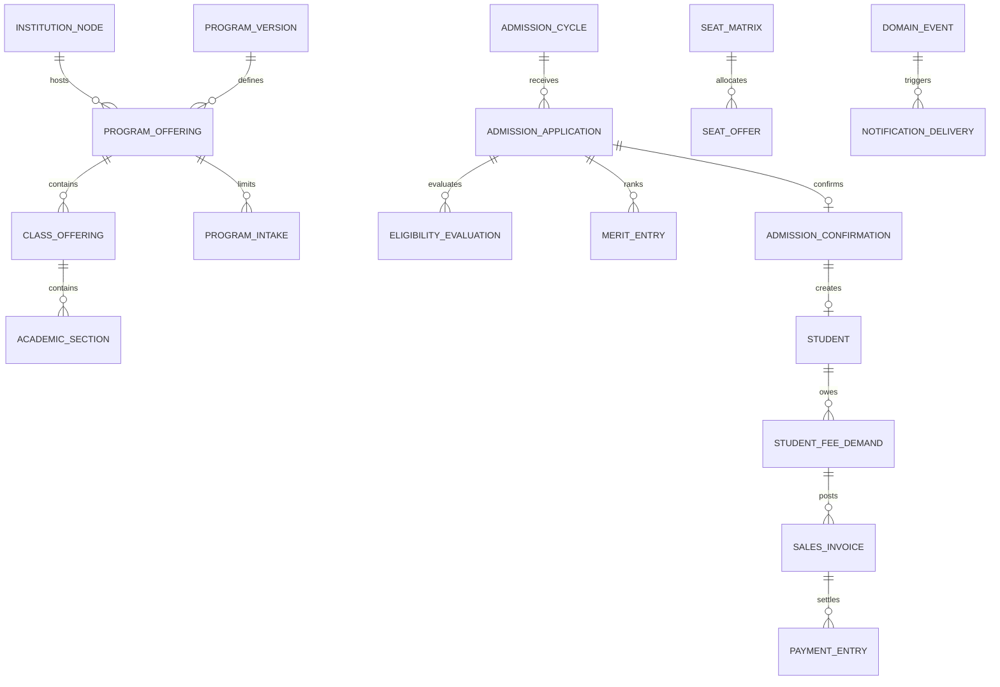

# Database Architecture

## Principles

- MariaDB is the authoritative transactional database supported by the selected Frappe v16 image.
- Each independent institution has a separate site database.
- ERPNext accounting documents and General Ledger are the source of truth for money.
- Custom DocTypes own educational policy and workflow, not a duplicate financial ledger.
- Effective-dated configuration and immutable published versions preserve history.
- Hard deletion is prohibited for referenced master, audit, admission, student, and financial records.

## Domain ownership

| Domain | Core records | Authoritative owner |
|---|---|---|
| Institution | Institution Node, structure version, reporting hierarchy | `university_erp.institution` |
| Academic | Program Version, Program Offering, curriculum, class, section, timetable, intake | `university_erp.academic` plus Education foundations |
| Identity | Student, applicant identity, guardians, category/status history, consent | Education plus `university_erp.student_identity` |
| Admissions | Cycle, application, eligibility, merit, seat matrix, offers, confirmation | `university_erp.admissions` |
| Fees | Fee policy, plan, demand, schedule, concession, operational allocation | `university_erp.fees` |
| Accounting | Invoice, Payment Request, Payment Entry, bank reconciliation, GL | ERPNext |
| Notifications | Template version, outbox, delivery attempt, provider status | `university_erp.notifications` |
| Compliance | Domain audit event, access log, retention action | Frappe audit plus `university_erp.compliance` |

## Entity relationships



This diagram is conceptual. Frappe Link fields and child tables must be validated against standard DocTypes before schema creation.

## Versioning pattern

Use stable identity plus effective version plus offering/transaction instance:

```text
Program              stable identity
Program Version      approved effective academic definition
Program Offering     version offered by institution/campus/session
Class Offering       operational class instance
```

Published or transaction-referenced versions cannot be edited in place. Create a new draft version, approve it, and make it effective from an explicit date/session.

## Required constraints

- Unique institution code within a site and effective hierarchy scope.
- Unique Student ID and enrollment number within the institution scope.
- One active applicant-to-student conversion record per application.
- One provider transaction identity per gateway/provider account.
- One outbox event identity and deduplicated consumer result.
- Unique published merit rank per run and configured rank scope.
- Seat allocation cannot exceed effective capacity under concurrent transactions.
- Monetary fields always specify currency and use institution-approved precision/rounding.
- Status fields have explicit allowed transitions and transition commands.

Frappe validation alone is insufficient for race-sensitive uniqueness. Use database unique indexes where supported and transactionally lock the smallest relevant capacity/payment/conversion row set.

## Transaction boundaries

Keep a single database transaction for:

- seat check, reservation, offer acceptance, and capacity update;
- applicant confirmation and student/enrollment creation;
- fee demand calculation and accounting document creation;
- payment verification and accounting posting;
- business state change and outbox insertion.

Never hold a database transaction open while calling a payment, SMS, email, antivirus, or identity provider. Persist intent, commit, perform the external call, and reconcile the result.

## Index strategy

Create indexes from measured query plans, not speculation. Initial high-volume candidates include:

- site-local status plus modified/creation date;
- admission cycle, program offering, application status, category;
- Student ID, enrollment number, normalized mobile/email hash;
- fee demand student, due date, status, academic session;
- provider transaction ID, settlement ID, payment status;
- outbox status, next attempt time, event type;
- notification status, provider, scheduled time;
- audit entity type/name and event time.

Every index migration requires expected query, cardinality, write impact, online/offline creation method, and rollback/forward-fix notes.

## Reporting reads

- Operational reports query permission-safe transactional views with pagination and bounded date ranges.
- Expensive exports run asynchronously and write private, expiring files.
- Read replicas may serve explicitly approved stale-tolerant reports.
- Financial reports must use ERPNext accounting semantics and reconcile to GL.
- Do not introduce a warehouse in Phase 1 unless reporting load is measured to threaten transactions.

## Audit data

Frappe Version and Activity Log provide platform history. Add append-only domain audit events for security-sensitive and high-value actions. Store actor, delegated actor, site, request/correlation ID, action, entity, prior/new state summary, reason, approval, timestamp, and source channel. Do not store secrets or unnecessary PII in audit payloads.

## Retention and archival

Retention periods are policy decisions and remain `TBD` until approved. The implementation must support legal hold, export, archival, anonymization where lawful, and auditable deletion. Financial and regulatory records must follow the institution's statutory requirements. Backups expire according to their own approved schedule and cannot be used to bypass deletion governance.

## Schema migration rules

- Frappe patches are deterministic, idempotent where practical, and version controlled.
- Use expand-and-contract for renamed, split, or transformed fields.
- Large backfills are resumable jobs with checkpoints and progress metrics.
- Test migration from the oldest supported production schema to the release candidate.
- Reconcile counts, keys, totals, references, permissions, and financial balances after migration.
- Never run destructive data cleanup without approved mapping, backup, dry run, and evidence.

