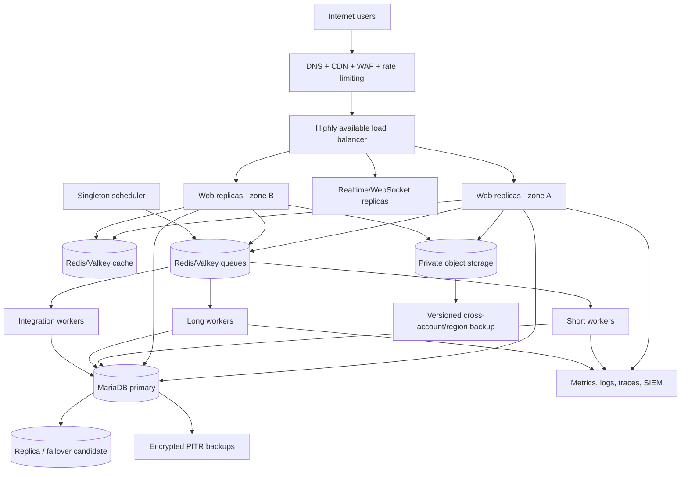

# Deployment Architecture

The first production-like staging target is Railway under ADR-0015. The current production baseline remains self-managed Hostinger VPS infrastructure behind Cloudflare, with Cloudflare R2 for private objects. AWS ECS/Fargate remains a portable alternative using the same immutable image and runtime roles. Use the [Hostinger production platform](../operations/hostinger-production-platform.md) for the concrete pilot topology and the [capacity plan](capacity-plan.md) for pod sizing and scale triggers.

## Deployment unit

Production runs an immutable image containing pinned SHAs or releases for Frappe, ERPNext, Education, CRM, and `university_erp`. The same image digest is promoted through development, UAT, staging, and production.

An independently governed institution receives a separate Frappe site, database, files namespace, encryption keys, backups, settings, users, and integration credentials. Multiple campuses may share one site only when governance, accounting, and reporting are shared.

## Production topology

## Service responsibilities

| Service | Responsibility | Scaling rule |
|---|---|---|
| Edge/WAF | TLS, DDoS controls, request limits, bot protection | Managed capacity |
| Frontend/reverse proxy | Static assets and request routing | At least two replicas |
| Web backend | Stateless HTTP/API execution | CPU/latency based horizontal scale |
| Realtime | WebSocket events | Connection-count based scale |
| Short workers | Notifications, simple webhooks, small jobs | Queue age and throughput |
| Long workers | Imports, merit, fee batches, exports | Queue age with per-job limits |
| Integration workers | Provider calls and reconciliation | Provider quota and retry rate |
| Scheduler | Enqueue scheduled work | One logical active leader per site |
| MariaDB | Authoritative transactions | Managed HA; vertical scale first |
| Redis/Valkey | Cache, queue, realtime coordination | Separate logical/physical workloads as needed |
| Object storage | Private files, exports, backups | Lifecycle, versioning, replication |

## Environments

| Environment | Data | Access | Purpose |
|---|---|---|---|
| Local | Synthetic only | Developers | Fast implementation and unit tests |
| CI | Ephemeral synthetic | CI workers | Automated validation |
| Development | Shared synthetic | Engineering | Integration and demos under development |
| UAT | Masked or generated | Product owners and business users | Acceptance evidence |
| Staging | Production-like masked | Restricted engineering/operations | Migration and release rehearsal |
| Production | Real | Least privilege | Live institutional operations |

Never copy unmasked production data to a non-production environment.

## Initial capacity baseline

Validate rather than assume these values:

- application capacity: 4-8 vCPU and 16-32 GB RAM across replicas;
- database: 4-8 vCPU, 16-32 GB RAM, provisioned IOPS, monitored connections;
- minimum two web replicas across failure domains;
- at least one worker per required queue, with no web/worker co-location dependency;
- object storage for private files and generated exports;
- headroom for admission and payment peaks of at least 40 percent after load testing.

## Network and security zones

- Only edge/load-balancer endpoints are internet-accessible.
- Database and Redis/Valkey have private network endpoints only.
- Administrative access uses SSO/MFA and audited bastion or zero-trust access.
- Egress is restricted to approved providers and repositories.
- Secrets come from a managed secret store at runtime.
- Separate backup credentials and accounts from the primary runtime account.

## Release strategy

Use expand-and-contract database changes. Deploy backward-compatible schema first, then code, backfill asynchronously, switch reads/writes, and remove obsolete fields in a later release. Maintenance mode is required when compatibility cannot be maintained.

Blue/green or rolling application deployment is safe only when old and new application versions can operate against the same schema. Database rollback after new writes is not assumed; use forward-fix or an explicitly approved restore with data-loss analysis.

## Tenant fleet operations

- Provision sites from automation, never hand-built production commands.
- Record site, institution, image digest, schema version, region, plan, and backup status in a fleet inventory.
- Stagger migrations and verify each batch before continuing.
- Apply per-site queue, storage, email/SMS, export, and API quotas.
- Monitor noisy-neighbor indicators by site without placing the site name in sensitive public metrics.

## Deployment acceptance

- Image provenance, signature, SBOM, and vulnerability policy pass.
- Database migration is rehearsed against a production-sized masked copy.
- Health, readiness, and smoke tests pass.
- Backup exists and restore prerequisites are verified.
- Monitoring and paging are active before traffic shifts.
- Rollback or forward-fix decision criteria and owner are recorded.
