# CI/CD Pipeline

## Objective

Build once, verify comprehensively, and promote the same signed image digest through environments with auditable approvals. CI has no production write credentials; deployment identity is separate and least-privileged.

## Pipeline stages

```mermaid
flowchart LR
    Commit --> Static["Format, lint, static analysis, secret scan"]
    Static --> Unit["Unit and changed-domain tests"]
    Unit --> Integration["Integration, permission, migration tests"]
    Integration --> Build["Pinned container build"]
    Build --> Supply["SBOM, provenance, sign, vulnerability scan"]
    Supply --> UAT["Deploy UAT and acceptance tests"]
    UAT --> Stage["Staging migration and release rehearsal"]
    Stage --> Approval["Production approval"]
    Approval --> Prod["Deploy exact digest"]
    Prod --> Smoke["Smoke, reconcile, monitor"]
```

## Pull-request checks

- Markdown/link and repository policy validation.
- Python/JavaScript formatting, lint and static/type checks adopted by the repository.
- Secret and credential pattern scan.
- Unit and changed-domain integration/permission tests.
- Fresh-site migration smoke test when metadata/patches change.
- API/event contract compatibility tests when contracts change.
- Dependency license and known-vulnerability policy checks.

## Main/release checks

- Full unit/integration/API suite.
- Fresh install and oldest-supported upgrade path.
- Frappe app matrix and asset build.
- Container build from pinned sources with no mutable branch dependency.
- SBOM and SLSA-compatible provenance where tooling supports it.
- Image signature and vulnerability scan.
- Publish immutable digest plus application SHA/schema manifest.
- Deploy to UAT/staging using environment-scoped configuration.

## Release-candidate gates

- Browser E2E and accessibility tests.
- Performance, concurrency and resilience scenarios.
- Security scans and required penetration evidence.
- Production-sized migration rehearsal with timing and reconciliation.
- Backup/restore verification and operational alert test.
- Product, finance, security, data and operations approvals.

## Migration policy

Run schema compatibility checks before traffic changes. Back up before incompatible migration. Use expand-and-contract and checkpointed backfills. A migration failure stops rollout; do not continue to later sites. Record per-site start/end, patch version, result and reconciliation.

## Promotion policy

- Environments promote image digests, not branch names.
- Production configuration and secrets are never baked into images.
- Approval records identify release, digest, sites, migrations, risks and operator.
- Emergency releases retain tests, review, provenance and post-incident follow-up; urgency is not permission to make interactive production edits.

## Rollback and forward-fix

Application rollback is allowed only if schema and queued jobs are compatible. Once new-version writes occur, database rollback may lose data; prefer forward-fix or a formally approved restore with explicit RPO/data-loss assessment. Pause consumers if event compatibility is uncertain.

## Pipeline security

- Pin CI actions/images/tools by trusted version or digest.
- Use short-lived workload identity instead of long-lived cloud keys.
- Protect release branches/tags and require reviewed approvals.
- Restrict artifact registry writes and production deploy permissions.
- Retain build logs, test evidence, SBOM, signatures and deployment audit.
- Prevent untrusted pull-request code from accessing protected secrets.

