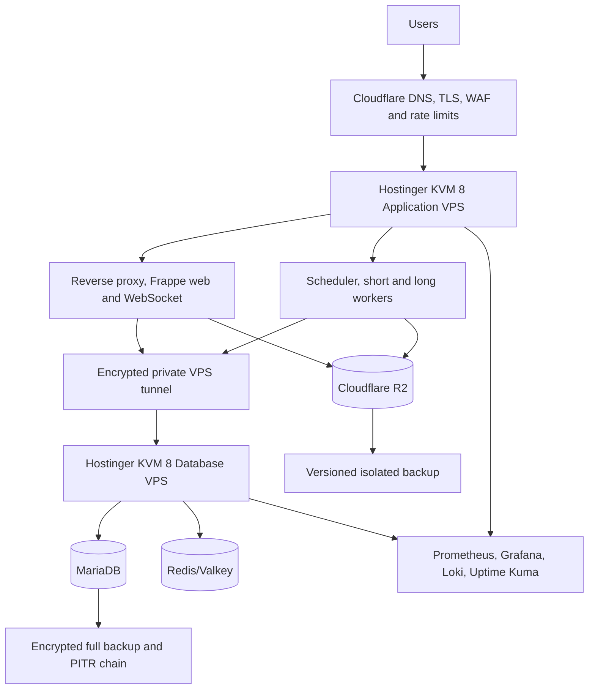

# Hostinger Production Platform

## Operating model

Hostinger VPS is self-managed. The project team owns operating-system patching, firewall, SSH, Docker, database operations, Redis/Valkey, TLS origin configuration, monitoring, backups, restore, incident response and capacity management.

## Pilot topology

Do not use the local `compose.yaml` unchanged in production. Production requires immutable images, no source bind mounts, protected secrets, resource limits, restart/readiness controls, TLS/proxy configuration, durable queue/database storage, backups and centralized telemetry.

## Host hardening

- Supported Ubuntu release and automatic security-update policy.
- SSH keys only, restricted source networks, root login disabled after bootstrap.
- Minimal firewall rules; database and Redis not public.
- Encrypted VPS-to-VPS network using an approved tunnel.
- Dedicated non-root deployment/operator accounts and audited sudo.
- Time synchronization, log rotation, disk alerts and file descriptor limits.
- Docker daemon/socket protected; no uncontrolled privileged containers.
- Regular base-image and OS patch windows with rollback/recovery plan.

## Production container roles

- Reverse proxy/frontend.
- Two or more Frappe web replicas when moving beyond pilot.
- WebSocket/realtime service.
- Singleton logical scheduler.
- Short, long, payment, notification and document workers as supported.
- MariaDB on the database node.
- Redis/Valkey workloads separated when measurement requires it.
- Monitoring exporters/agents.

## Site pod model

After pilot, group approximately 20-25 measured institution sites per pod. A mature pod should use at least two application nodes and an independently recoverable database node; add a tested replica/failover candidate where Hostinger architecture permits.

Do not onboard all 100 institutions onto one VPS or one MariaDB instance. Fleet inventory records every site's pod, image digest, schema, database, bucket, provider configuration, quotas, backup and owner.

## Deployment procedure

1. Approve image digest, app SHAs, SBOM, scans and release evidence.
2. Confirm target sites/pod, backup and migration window.
3. Pull the exact signed digest.
4. Pause affected scheduler/consumers and enter maintenance where required.
5. Run migration preflight and controlled site batches.
6. Start web, realtime, workers and scheduler with readiness checks.
7. Run technical and business smoke tests.
8. Reconcile payment, fee/GL, queue, file and migration state.
9. Observe through the soak window before closing.

## Backups and recovery

- Daily logical/full site database backup.
- MariaDB binary logs/PITR sufficient for 15-minute RPO.
- R2 object versioning and isolated backup credentials.
- Site encryption key, configuration, app manifest and image digest included in the recovery set.
- Monthly rotating-site restore test.
- Pilot DR exercise and twice-yearly exercises thereafter.

Hostinger snapshots supplement but do not replace application-aware backups and restore evidence.

## Scale triggers

Rebalance or add capacity before disk exceeds 70 percent, sustained CPU/memory/database pressure, queue or latency SLO breach, migration/backup window overrun, insufficient 40 percent peak headroom, or noisy-neighbor impact.

## Production acceptance

- Database/Redis are private and the encrypted tunnel is verified.
- Restore meets RPO/RTO.
- Cloudflare edge and origin restrictions pass.
- R2 private access and malware quarantine pass.
- Razorpay/MSG91/SMTP controlled tests pass.
- Dashboards, alerts, runbooks and on-call are active.
- No unaccepted critical/high security or reconciliation finding remains.

