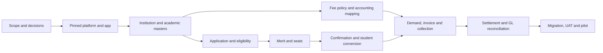

# Phase-1 Delivery Plan

This plan defines capability sequencing; the authoritative live step and prerequisites are in the [project execution roadmap](../../PROJECT_EXECUTION_ROADMAP.md). Confirm the [current implementation status](../current-implementation-status.md) before claiming any deliverable complete. After pilot acceptance, rollout proceeds in measured 5, 20, 50, and 100-institution waves using isolated 20-25-site pods.

## Calendar baseline

| Workstream | Weeks | Outcome |
|---|---:|---|
| Sprint 0 | 1 | Architecture, data contracts, role model, compatibility proof |
| Phase 1A | 2-5 | Academic, student, fee masters |
| Phase 1B | 6-9 | Admissions, merit/seats, fee collection |
| Phase 1C | 10-13 | Integration, migration, testing, pilot |
| Cross-cutting platform | 1-13 | Security, CI/CD, observability, notifications, QA |

The calendar assumes parallel squads and embedded QA. If staffing or decision turnaround cannot support parallel delivery, rebaseline dates without dropping gates.

## Sprint 0 exit gate

- Exact Frappe/ERPNext/Education/CRM/image SHAs pass compatibility proof.
- Custom app and reproducible development environment exist.
- Story-level fit-gap and missing fee/academic stories are identified.
- ERD/domain ownership, API/event conventions, and role-permission matrix are approved.
- Accounting transaction pattern passes a proof of concept.
- Site-per-institution, files, backup, audit, notification outbox, and deployment choices are recorded.
- Pilot volume, providers, migration sources, SLOs, RPO/RTO, retention, and compliance owners are known or explicitly blocked.

## Phase 1A deliverables

- Institution hierarchy, history, reporting scope, lock and clone.
- Academic calendar, programs, versions, offerings, curriculum, CBCS, NEP, class and section.
- Timetable, faculty assignment/workload, intake, reservation, promotion.
- Student identity, IDs, dedupe, guardians, category/domicile, documents, consent and corrections.
- Fee groups, codes, policy versions, applicability, schedules, installments and accounting mapping.
- Permission-safe workspaces, reports, test factories, migrations and audit events.

Exit: one institution can configure a complete offering and student/fee master flow; lock/version/permission tests pass.

## Phase 1B deliverables

- CRM handoff, admission cycle, dynamic form versions and save/resume.
- Eligibility engine with explainable results and controlled override.
- Application fee, scrutiny, merit, tie-breakers, seat matrix, allocation, waitlist and offers.
- Acceptance/rejection, confirmation/cancellation, student/enrollment conversion.
- Fee demands/invoices, gateway and offline payments, receipts, partial allocations, fines, concessions, scholarships, refunds and reconciliation.
- Notifications, applicant tracking, operational dashboards and permission-safe exports.

Exit: enquiry-to-student and fee-to-GL journeys pass concurrency, duplicate, failure, audit, finance and product-owner acceptance.

## Phase 1C deliverables

- Full regression, browser E2E, accessibility, security and performance tests.
- Provider failure/retry and reconciliation simulations.
- Migration trial loads with count, reference and financial reconciliation.
- Production-like deployment, monitoring, backup restore and DR exercise.
- UAT, training, support workflow, cutover runbook and hypercare plan.

Exit: no open Severity 1/2 defects; signed UAT, finance reconciliation, security review, restore evidence and go-live approval.

## Critical dependency chain

## Delivery controls

- A story cannot enter implementation without acceptance criteria, data ownership, permissions, audit needs, failure behavior, and test plan.
- Schema/API/event changes require migration and compatibility notes.
- Accounting, permission, PII, integration and infrastructure changes require specialist review.
- Demo completion is not production completion.
- Burndown does not override unresolved financial, security, concurrency, restore, or migration risk.
